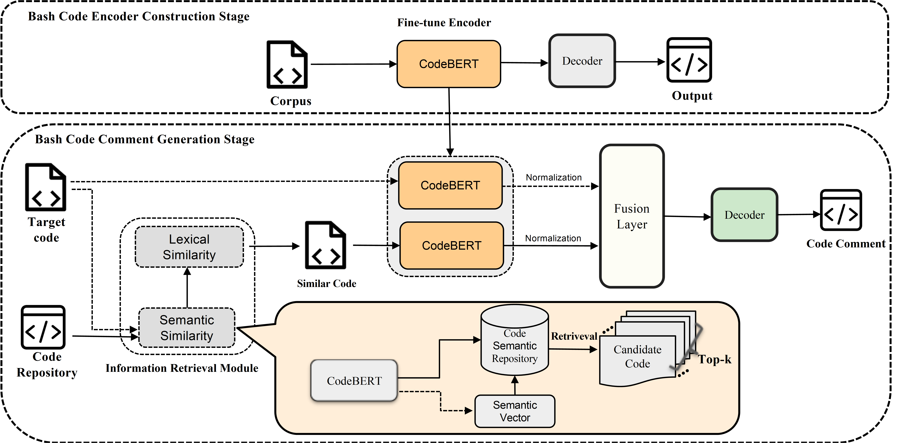

# [BASHEXPLAINER: Retrieval-Augmented Bash Code Comment Generation based on Fine-tuned CodeBERT](https://arxiv.org/pdf/2206.13325.pdf)

**Source Code:** https://github.com/NTDXYG/BASHEXPLAINER

**Datasets:** [nl2bash](https://huggingface.co/datasets/jiacheng-ye/nl2bash), [NLC2CMD](https://github.com/magnumresearchgroup/Magnum-NLC2CMD)

**Affiliation:** 

**Year of Submission:** 2022

## What problem does it solve?

## How does it solve it?

### Model

CodeBERT

## How is this paper novel?

## Key takeaways

## What I still do not understand?

## Ideas to pursue
