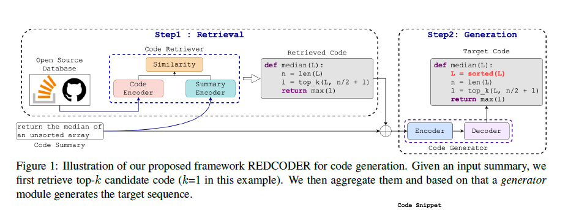

# [Retrieval Augmented Code Generation and Summarization](https://arxiv.org/abs/2108.11601)

**Source Code:** https://github.com/rizwan09/REDCODER

**Datasets:** CodeXGLUE, Concode

**Affiliation:** Columbia University, University of California Los Angeles

**Year of Submission:** 2021

## What problem does it solve?

Code generation

## How does it solve it?

### Model

CodeBERT

## How is this paper novel?

## Key takeaways

## What I still do not understand?

## Ideas to pursue
