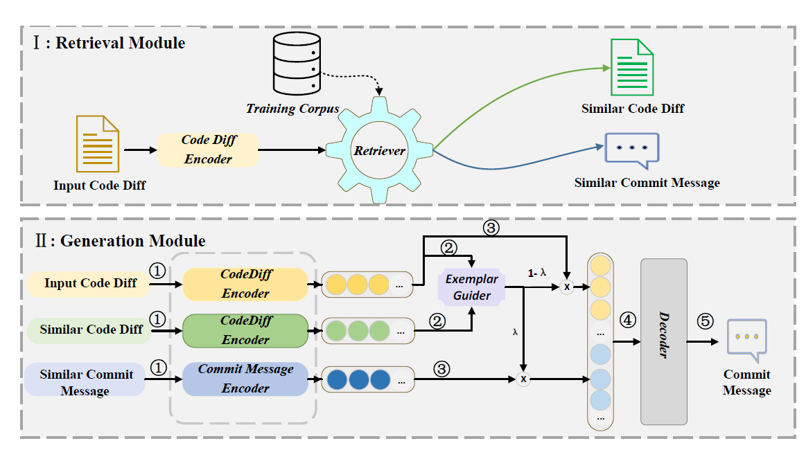
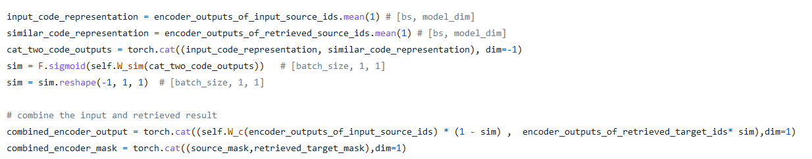

# [RACE: Retrieval-Augmented Commit Message Generation](https://arxiv.org/abs/2203.02700)

**Source Code:** https://github.com/DeepSoftwareAnalytics/RACE

**Datasets:** https://paperswithcode.com/dataset/mcmd

**Affiliation:** Microsoft

**Year of Submission:** 2021

## What problem does it solve?

## How does it solve it?

### Model

Salesforce/codet5-base

## How is this paper novel?

## Key takeaways

## What I still do not understand?

## Ideas to pursue
