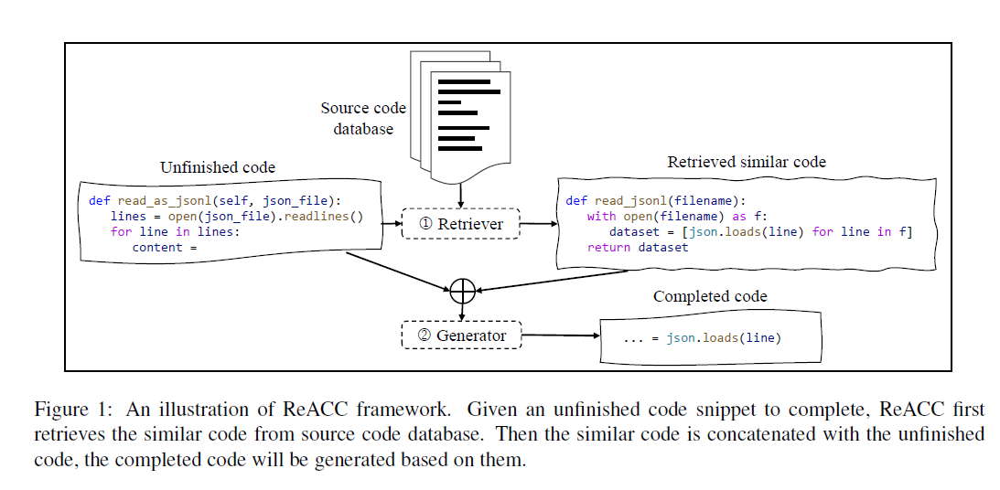
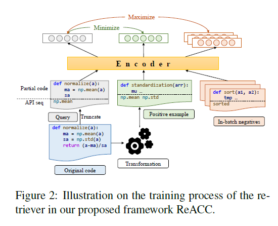

# [ReACC: A Retrieval-Augmented Code Completion Framework](https://arxiv.org/pdf/2203.07722.pdf)

**Source Code:** https://github.com/microsoft/ReACC

**Datasets:**  ['CodeSearchNet', 'CodeXGLUE']

**Affiliation:** Microsoft

**Year of Submission:** 2022

## What problem does it solve?

## How does it solve it?

### Model

Roberta

## How is this paper novel?

## Key takeaways

## What I still do not understand?

## Ideas to pursue
