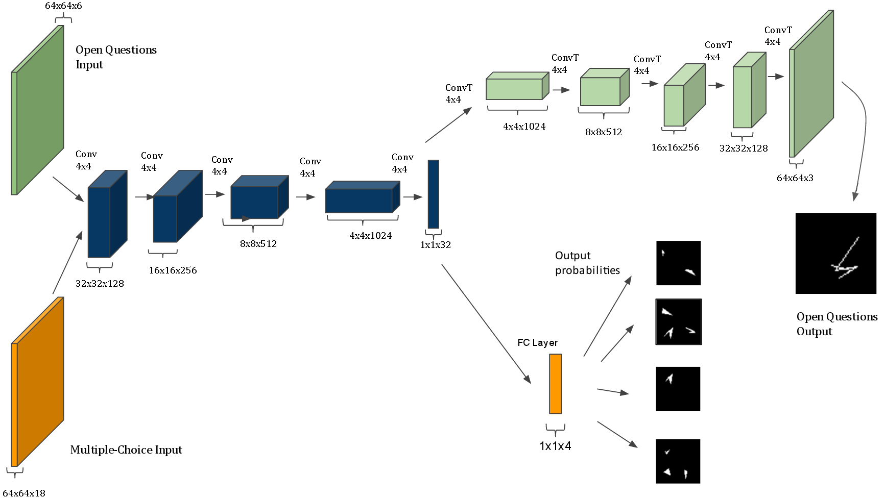
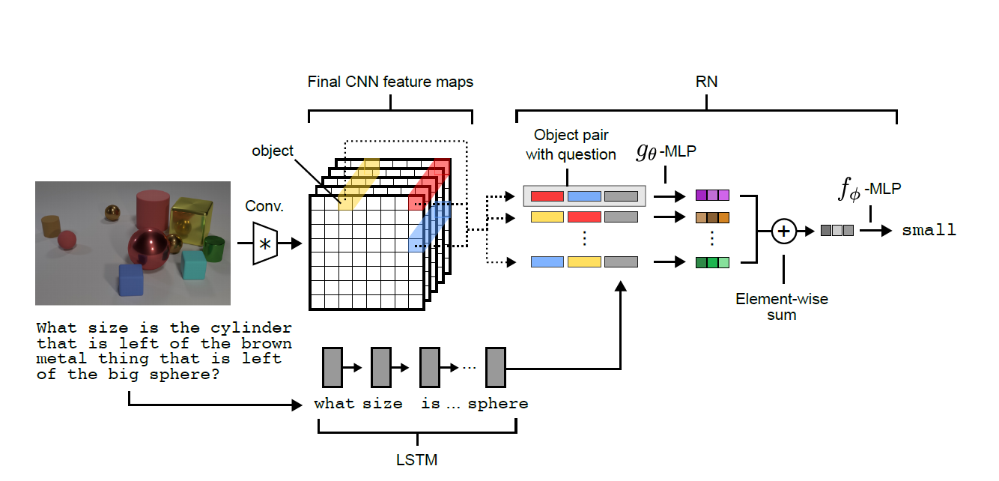

# Abstract Reasoning Digest

## [The IQ of Neural Networks](https://arxiv.org/abs/1710.01692)

**Source Code:** [???]()

**Datasets:** (generated)

**Time to read:** 100 mins

**Easy to read?:** Yes

**Author:** Dokhyam Hoshen and Michael Werman

**Year of Submission:** 2017

### What problem does it solve?

Make CNNs solve Ravens Matrix

### How does it solve it?

Dataset generation
1. Pick a shape at random (triangles, squares, circles, random squiggles)
2. Apply a random transformation to generate the second image (rotation, size, reflection, number, color, addition)
3. Apply the same transformation again to generate the answer or different transformations to generate other answers

#### Model

RGB images



### How is this paper novel?

Nobody else is interested in this field of research

### Key takeaways

1. Number (count) transforms are the hardest
2. Reflection and Rotation transforms are hard

### What I still do not understand?

1. Were the weights tied in the autoencoder?

### Ideas to pursue

1. Zero shot learning might be possible

## [Measuring abstract reasoning in neural networks](https://arxiv.org/abs/1807.04225)

**Source Code:** (???)

**Datasets:** [Generated](https://deepmind.com/blog/measuring-abstract-reasoning/) 

**Time to read:** 325

**Easy to read?:** Yes. Too lengthy. Relnet explanation insufficient.

**Author:** (DeepMind) David G.T. Barrett, Felix Hill, Adam Santoro, Ari S. Morcos, Timothy Lillicrap

**Year of Submission:** 2018

### What problem does it solve?

Ravens style progressive matrixes

1. Can NNs find solns to complex abstract reasoning tasks?
2. How well does it generalize?

> The research presented here was therefore motivated by two main goals. (1) To understand whether, and (2) to understand how, deep neural networks might be able to solve abstract visual reasoning problems.

### How does it solve it?

Feed the inputs into various models and do a classification using softmax cross entropy using the Adam optimizer. Also, make the model predit which operations were performed in the transformation.

Hyper parameter tuning using grid sweep minimize cross entropy loss.

#### Dataset generation

Wang, K. and Su, Z. Automatic generation of ravens progressive matrices. In Twenty-Fourth International Joint Conference on Artificial Intelligence, 2015.

#### Models


**CNN-MLP** 
1. Four layer CNN.
2. Batch norm with relu
3. Two fully connected layer layers with .5 dropout on the last layer

**ResNet** - Resnet50 performed best
1. Each input was a featuremap

**LSTM** 
1. Pass input through 4 layer CNN to get embeddings with batch norm
2. Tag each embedding with a one hot embedding to denote panels position
3. Pass the sequence through LSTM with dropout
4. Feed the final hidden state to a fully connected layer to get logits and cross entropy

**Wild Relation Network(WReN)**
1. Process each panel independently using a small CNN
2. Tag the vector with a label
3. Take all embeddings of context and a candidate pairwise
4. Pass it through a fully connected layer and take summation. 
5. Pass the summed vector through another fully connected layer.
5. Outputs a (1-d ?) score for a given candidate
6. Softmax this vector for backpropagation and argmax is the result

**Wild ResNet**
1. Eight context panel and one canditate is fed as input.
2. Candidate with the highest score is the answer

**Context blind Resnet**
1. Some NNs exploit statistical regularities in the choices.
2. Feed the 8 choices in and ask the NN to predit the correct answer

#### Auxilary training

1. Encode the operations performed as a binary string (shape, line, color, number, position, size, type, progression, XOR, OR, AND, consistent union) of length 12.
2. Make the model predit this target (softmax crossentropy)
3. Ltotal = Ltarget + beta * Lmeta-target

### How is this paper novel?

1. Usage of raw pixels instead of symbolic inputs and training instead of hardcoded strategies by cognitive theories.
2. Hoshen and Werman did not address the problem of resolving complete RPMs.
3. Study of generalization which differ substantially from training data.

### Key takeaways

1. Distractions in generated set can provide additional challenge. They decrease accuracy significantly.
2. Pairwise comparison of image embeddings and candidate embeddings.
3. Making the neural network predict the operations performed increases its performance. Auxilary training led to 13.9% improve in accuracy. 87% accuracy when meta was correct while 34.8% when meta was incorrect.
4. Simple CNN based models failed completely.
5. LSTM performed marginally better due to the ability to consider individual canditate panels in sequence.
6. Resnet50 did well.
7. WReN performed best due to the relation network module.
8. Single transforms were easier than chained transforms.
9. OR, lines and number are easiest while size is hardest.
10. Did ok on held out tripples but did not understand held out attributes.

### What I still do not understand?

1. PGM = Progressive Matrices?
2. Relation Network

### Ideas to pursue

1. Train regressor on both horizontal and vertical axes
2. Encode everything and compare pairwise.
3. Make the NN explain what operations it took.
4. For unsupervised learning, see if knowledge transfers accross problems.

## [A simple neural network module for relational reasoning](https://arxiv.org/abs/1706.01427v1)

**Source Code:** [Tensorflow](https://github.com/siddk/relation-network), [Pytorch](https://github.com/kimhc6028/relational-networks)

**Datasets:** [CLEVR](https://cs.stanford.edu/people/jcjohns/clevr/),[bAbI](https://research.fb.com/downloads/babi/) and generated

**Time to read:** 260

**Easy to read?** Yes. Lengthy but no fluff. 

**Author:** (DeepMind) Adam Santoro, David Raposo, David G.T. Barrett, Mateusz Malinowski, Razvan Pascanu, Peter Battaglia, Timothy Lillicrap

**Year of Submission:** 2017

### What problem does it solve?

Visual question answering in the relational domain.

e.g. *In the picture, what color is the square on the right hand side of the red circle?*

### How does it solve it?

```
# Pass the raw pixels through a CNN to get image embedings
image_embeddings = CNN()(input_image)

# Slice the image embeddings in the from [i,j,:] to get objects
x_y = image_embeddings.shape[0] * image_embeddings.shape[1] 
z = image_embeddings.shape[2] 
set_of_objects = image_embeddings.reshape((x_y, z))
n = len(set_of_objects)

# Encode the question to an embedding
q = LSTM()(word_embedding(question_string))

# Encode the relations
f = DNN()
g = DNN()
encoded_relations = [[g(set_of_objects[i], set_of_objects[j], q) \
                        for j in range(n)] \
                        for i in range(n)]

# [i, j, embeding_vector_dimension]
output = f(reduce_sum(encoded_relations, axis=[0,1]))
classification = softmax_crossentropy(output) # MCQ type testing
```

#### Dataset (CLEVR)

The dataset contains a 3D rendered image, a question and an answer.

Types of questions
1. **Query** - What is the color of the sphere?
2. **Compare** - Is the cube the same material oas the cylinder?

Versions of CLEVR
1. Pixel Version
2. State description - 3D coord, color, shape, material, size

95.5% accuracy (super human)

#### Dataset (Sort of CLEVR)

2D images with only relational questions. 6 objects per scene, square or triangle and 6 different colors. Questions are binary strings instead of natural language.

96.4% accuracy

#### Dataset (bAbI)

Text based dataset with deduction, induction and counting. *Sandra picked up the football. Sandra went to the office. Where is the football? answer: Office.*

Achieved a score of > 95% in 18/20 tasks

Failed in two supporting facts and three supporting facts

#### Dataset (Dynamic physical systems)

Mass spring system. Each sceene has 10 colored balls on a tabletop surface. Balls can be free, or attached to another ball by a spring or rigid constraint.

Input data is state descriptions of matrices. Each ball is a row in a matrix with RGB values and spatial coords accross 16 sequential time steps.

Tasks
1. Infer the existence of connections between balls.
2. Count the number of systems on the table. 

95% accuracy

#### Model



1. CNN was used to parse pixels to objects.
2. After all the convolutional layers the slice `[i,j,k,:]` (`[N,H,W,C]`) is considered to be an object.
3. Question words were assigned unique integers which were then used to index a learnable lookup table that provided embeddings to the LSTM.
4. The object descriptor pairs and the question embedding is concatenated and fed into the `f` DNN.
5. Summation is taken and the result vector is fed into the `g` DNN.
6. Softmax cross entropy classification

**State descriptors** - They were fed directly into the RN.

**Natural Language**
1. Take last 20 sentences.
2. Tag with labels indicating relative position.
3. Process each sentence into a vector using LSTM.

### How is this paper novel?

1. Usage of Relational Networks.
2. Demonstration that relational networks can also operate on image embeddings.
3. Achieved state of the art by 20%+

### Key takeaways

1. **RNs learn to infer relations** - They consider all potential relations. 
> In graph theory parlance, the input can be thought of as a complete and directed graph whose nodes are objects and whose edges denote the object pairs whose relations should be considered.

2. **RNs are data efficient** - `n^2` datapoints are available for training from an object set of length n due to the pairwise input of data. Since the same DNN is being used for all pairs, it is encouraged to not overfit. The size of the network does not need to scale with the number of interactions.

3. **RNs operate on a set of objects** - The summation, in the equation, ensures order invariance. 

4. Fails when objects are heavily occluded or a high precision object position representation is required. 

### What I still do not understand?

1. > So, after convolving the image, each of the d2 k-dimensional cells in the d x d feature maps was **tagged with an arbitrary coordinate** indicating its relative spatial position, and was treated as an object for the RN.
2. > Question words were assigned unique integers, which were then used to index a **learnable lookup table** that provided embeddings to the LSTM.
3. Dynamic physical system reasoning methodology in appendix

### Ideas to pursue

1. The definition of object looks weird. Multiple cells can have the same shape or one cell can have multiple shapes.
