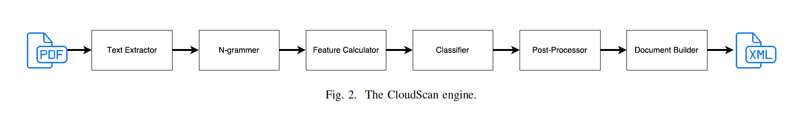
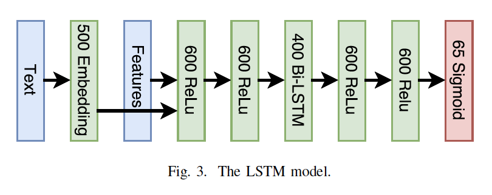

# Invoice Parsing

## [CloudScan - A configuration-free invoice analysis system using recurrent neural networks](https://arxiv.org/abs/1708.07403)

**Source Code:** [Github](https://github.com/naiveHobo/InvoiceNet)

**Datasets:** Private (Size: 300k+)

**Time to read (mins):** 100

**Author:** (Technical University of Denmark) Rasmus Berg Palm, Ole Winther, Florian Laws

**Year of Submission:** 2017

### What problem does it solve?

Template-less scanning of invoices. It extracts a single fixed set of fields from all invoices.

These fields are in focus: Invoice number, issue date, currency, order id, total, line total, tax total, tax percentage.

Table extraction is a *WIP*.

### How does it solve it?

Steps
1. Extract text and position of text from PDFs. If text data is available then use that else use OCR.
2. Create N-grams (<= 4) of words in the same line.
3. Extract features 
    1. Like class (text, numeric or other). Replace all alphabets with `X` and numbers with `0` and all other characters with `.`.
    2. Normalized position, width, height
    3. Number of words to the left
    4. Boolean features like whether the N-gram parses a date, amount, country, city, zip code.
4. Classify each N-gram into 32 fields of interest e.g. invoice number, total, date etc and an undefined field. So, 33 in total.
5. A regex parser tries to parse that classified field. If parsing fails, then the field is discarded. Small errors like mistaking `0` with `O` is automatically rectified. For fields with no semantic connection, Hungarian algorithm is used. 
6. A *Universal Business Language* document is generated from the extracted data.

> The sequence of words ”Total Amount: 12 200 USD” would be labeled ”O O B-Total I-Total B-Currency”.

The text is hashed into `2^18` binary vector, which is passed to a embedding layer which generates a 500 dimensional vector.

Normalize the feature vectors to have zero mean and unit variance.

All embedded words are fed into the RNN classifier in left to right order. Chunking into n-grams is done post classification.

The sequences that do not follow the IOB specification are discarded.

#### Model

Architecture

### Key takeaways

1. Group the text in the regions of interest as n-grams
2. Using hashing to implement the *bag of words* instead of using a look up dictionary worked with no noticible difference.
3. > we apply dropout on the recurrent units and on the word embedding using a dropout fraction of 0.5 for both. Without this dropout the model severely overfits.
4. Making parts of the system oracle is great for evaluating the performance of the remaining parts.
5. Automatically generated training data was used.
6. Temptation to automatically correct numbers like `16 2054` to `162054` was resisted because that might lead to errors in certain fields like `Tax %`.
7. Order ID was hardest to parse, currency was easiest. 
8. Replacing LSTM with feed forward network gives a much worse performance.
9. The neural network only works on word level. It does not take graphical features into account like lines.

### What I still do not understand?

1. Read about hungarian algorithm
2. IOB labeling - L. A. Ramshaw and M. P. Marcus, “Text Chunking Using Transformation-Based Learning,” Proceedings of the Third ACL Workshop on Very Large Corpora, pp. 82–94, 1995.
3. Read about byte pair encoding.

### Ideas to pursue

1. Replace all alphabets with `X` and numbers with `0` and all other characters with `.`.
2. Find a ready to use, UBL JSON schema.
