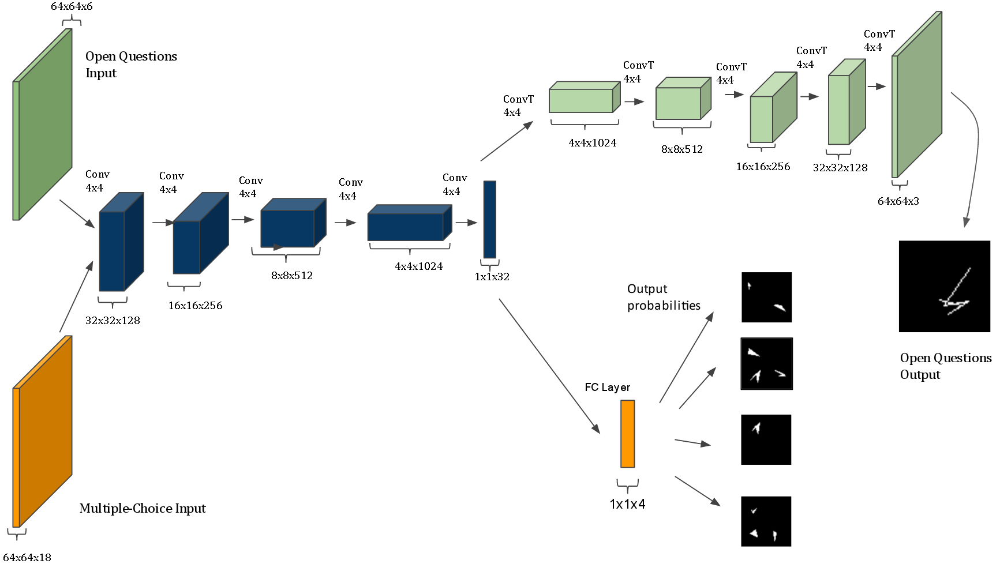

## [The IQ of Neural Networks](https://arxiv.org/abs/1710.01692)

**Source Code:** [???]()

**Datasets:** (generated)

**Time to read:** 100 mins

**Easy to read?:** Yes

**Author:** Dokhyam Hoshen and Michael Werman

**Year of Submission:** 2017

### What problem does it solve?

Make CNNs solve Ravens Matrix

### How does it solve it?

Dataset generation
1. Pick a shape at random (triangles, squares, circles, random squiggles)
2. Apply a random transformation to generate the second image (rotation, size, reflection, number, color, addition)
3. Apply the same transformation again to generate the answer or different transformations to generate other answers

#### Model

RGB images

### How is this paper novel?

Nobody else is interested in this field of research

### Key takeaways

1. Number (count) transforms are the hardest
2. Reflection and Rotation transforms are hard

### What I still do not understand?

1. Were the weights tied in the autoencoder?

### Ideas to pursue

1. Zero shot learning might be possible
