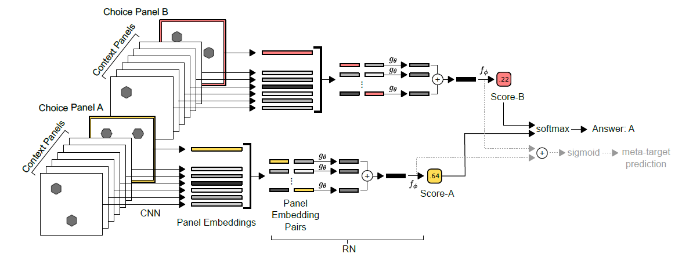

# Abstract Reasoning Digest

## [The IQ of Neural Networks](https://arxiv.org/abs/1710.01692)

**Source Code:** [???]()

**Datasets:** (generated)

**Time to read:** 100 mins

**Easy to read?:** Yes

**Author:** Dokhyam Hoshen and Michael Werman

**Year of Submission:** 2017

### What problem does it solve?

Make CNNs solve Ravens Matrix

### How does it solve it?

Dataset generation
1. Pick a shape at random (triangles, squares, circles, random squiggles)
2. Apply a random transformation to generate the second image (rotation, size, reflection, number, color, addition)
3. Apply the same transformation again to generate the answer or different transformations to generate other answers

#### Model

RGB images

### How is this paper novel?

Nobody else is interested in this field of research

### Key takeaways

1. Number (count) transforms are the hardest
2. Reflection and Rotation transforms are hard

### What I still do not understand?

1. Were the weights tied in the autoencoder?

### Ideas to pursue

1. Zero shot learning might be possible

## [Measuring abstract reasoning in neural networks](https://arxiv.org/abs/1807.04225)

**Source Code:** (???)

**Datasets:** [Generated](https://deepmind.com/blog/measuring-abstract-reasoning/) 

**Time to read:** 325

**Easy to read?:** Yes. Too lengthy. Relnet explanation insufficient.

**Author:** (DeepMind) David G.T. Barrett, Felix Hill, Adam Santoro, Ari S. Morcos, Timothy Lillicrap

**Year of Submission:** 2018

### What problem does it solve?

Ravens style progressive matrixes

1. Can NNs find solns to complex abstract reasoning tasks?
2. How well does it generalize?

> The research presented here was therefore motivated by two main goals. (1) To understand whether, and (2) to understand how, deep neural networks might be able to solve abstract visual reasoning problems.

### How does it solve it?

Feed the inputs into various models and do a classification using softmax cross entropy using the Adam optimizer. Also, make the model predit which operations were performed in the transformation.

Hyper parameter tuning using grid sweep minimize cross entropy loss.

#### Dataset generation

Wang, K. and Su, Z. Automatic generation of ravens progressive matrices. In Twenty-Fourth International Joint Conference on Artificial Intelligence, 2015.

#### Models

**CNN-MLP** 
1. Four layer CNN.
2. Batch norm with relu
3. Two fully connected layer layers with .5 dropout on the last layer

**ResNet** - Resnet50 performed best
1. Each input was a featuremap

**LSTM** 
1. Pass input through 4 layer CNN to get embeddings with batch norm
2. Tag each embedding with a one hot embedding to denote panels position
3. Pass the sequence through LSTM with dropout
4. Feed the final hidden state to a fully connected layer to get logits and cross entropy

**Wild Relation Network(WReN)**
1. Process each panel independently using a small CNN
2. Tag the vector with a label
3. Take all embeddings of context and a candidate pairwise
4. Pass it through a fully connected layer and take summation. 
5. Pass the summed vector through another fully connected layer.
5. Outputs a (1-d ?) score for a given candidate
6. Softmax this vector for backpropagation and argmax is the result

**Wild ResNet**
1. Eight context panel and one canditate is fed as input.
2. Candidate with the highest score is the answer

**Context blind Resnet**
1. Some NNs exploit statistical regularities in the choices.
2. Feed the 8 choices in and ask the NN to predit the correct answer

#### Auxilary training

1. Encode the operations performed as a binary string (shape, line, color, number, position, size, type, progression, XOR, OR, AND, consistent union) of length 12.
2. Make the model predit this target (softmax crossentropy)
3. Ltotal = Ltarget + beta * Lmeta-target

### How is this paper novel?

1. Usage of raw pixels instead of symbolic inputs and training instead of hardcoded strategies by cognitive theories.
2. Hoshen and Werman did not address the problem of resolving complete RPMs.
3. Study of generalization which differ substantially from training data.

### Key takeaways

1. Distractions in generated set can provide additional challenge. They decrease accuracy significantly.
2. Pairwise comparison of image embeddings and candidate embeddings.
3. Making the neural network predict the operations performed increases its performance. Auxilary training led to 13.9% improve in accuracy. 87% accuracy when meta was correct while 34.8% when meta was incorrect.
4. Simple CNN based models failed completely.
5. LSTM performed marginally better due to the ability to consider individual canditate panels in sequence.
6. Resnet50 did well.
7. WReN performed best due to the relation network module.
8. Single transforms were easier than chained transforms.
9. OR, lines and number are easiest while size is hardest.
10. Did ok on held out tripples but did not understand held out attributes.

### What I still do not understand?

1. PGM = Progressive Matrices?
2. Relation Network

### Ideas to pursue

1. Train regressor on both horizontal and vertical axes
2. Encode everything and compare pairwise.
3. Make the NN explain what operations it took.
4. For unsupervised learning, see if knowledge transfers accross problems.
