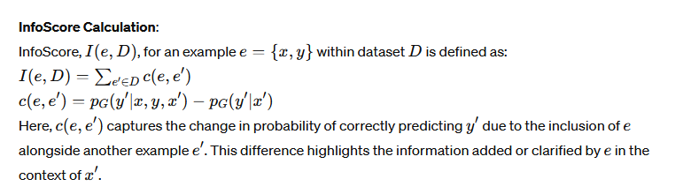
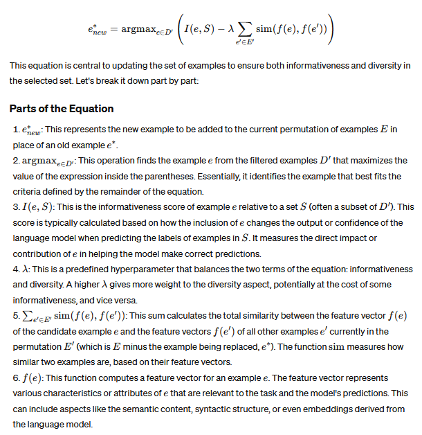

# [Finding Support Examples for In-Context Learning](https://arxiv.org/pdf/2302.13539)

## Meta

* Journal - EMNLP
* Year - 2023
* Author - Fudan University
* Code - 
* One liner - Graph cut diversity, and informativeness quality
* Model - GPT2L
* Datasets - SST2, SST5, amazon reviews MR, subj, trec, agnews, dbpeadia
* Baselines - zeroshot, random, herding, kcenter, entropy, least confidence, margin, cal, forgetting, grand, craig, gradmatch, fl, gc, glister, random and valid, lens

## Equations





## Proofs

## Algorithms

Progressive exammple filtering

```python
import random

def calculate_informativeness(example, reference_set, model):
    """
    Placeholder function to calculate the informativeness score of an example based on a reference set and language model.
    This function should be adapted to perform the actual computation of informativeness.
    """
    # Example implementation:
    # score = sum(model.predict_prob(y_prime, x, y, x_prime) - model.predict_prob(y_prime, x_prime) for x_prime, y_prime in reference_set)
    # return score
    pass

def progressive_example_filtering(dataset, model, target_size, progressive_factor, initial_score_size):
    """
    Performs progressive filtering of examples to identify individually informative examples.

    :param dataset: List of training examples (ei)
    :param model: The language model (G)
    :param target_size: Desired number of candidate examples to retain
    :param progressive_factor: Progressive factor for filtering
    :param initial_score_size: Initial number of examples to use for scoring (l)
    :return: A subset of dataset that are considered informative
    """
    filtered_set = dataset.copy()
    initial_samples = random.sample(dataset, initial_score_size)  # Initial random sample from the dataset
    
    while len(filtered_set) > target_size:
        # Calculate informativeness scores for each example in the filtered set
        scores = {example: calculate_informativeness(example, initial_samples, model) for example in filtered_set}
        
        if len(filtered_set) // progressive_factor < target_size:
            # If reducing the filtered set by the progressive factor would go below target size, retain only top target_size examples
            filtered_set = sorted(filtered_set, key=lambda x: scores[x], reverse=True)[:target_size]
            break
        else:
            # Otherwise, reduce the size of the filtered set by the progressive factor
            filtered_set = sorted(filtered_set, key=lambda x: scores[x], reverse=True)[:len(filtered_set) // progressive_factor]
        
        # Expand the reference set for the next iteration
        additional_samples = random.sample(dataset, int(initial_score_size * (progressive_factor - 1)))
        initial_samples.extend(additional_samples)  # Update the reference set with new samples
    
    return filtered_set  # Return the filtered set of informative examples

# Example usage
dataset = [("x1", "y1"), ("x2", "y2"), ...]  # Your dataset
model = None  # Your language model placeholder
target_size = 50  # Desired final number of examples
progressive_factor = 2  # Progressive factor
initial_score_size = 10  # Initial number of examples for scoring

informative_examples = progressive_example_filtering(dataset, model, target_size, progressive_factor, initial_score_size)
```

## Experiments

* Performance distribution of support examples (?)
* Support examples transferability
* hyperparameter ablations
* effect of progressive filtering
