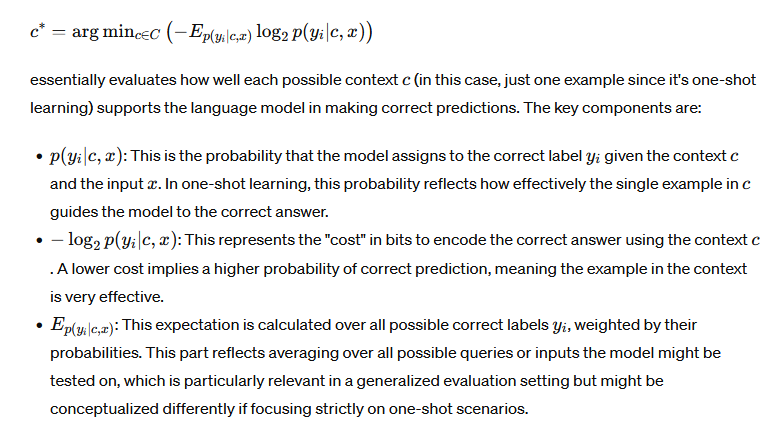

# [Self-Adaptive In-Context Learning: An Information Compression Perspective for In-Context Example Selection and Ordering](https://arxiv.org/pdf/2212.10375)

## Meta

* Journal - Association for Computational Linguistics
* Year - 2023
* Author - Shanghai Artificial Intelligence Laboratory, Xiamen University, The University of Hong Kong
* Code - https://github.com/Shark-NLP/self-adaptive-ICL
* One liner - Shortlist with similarity, then rerank and shortlist with confidence on downstream target
* Model - GPT2-XL (1.5B)
* Datasets - sst2, sst5, snli, mnli, qnli, trec, agnews, cms
* Baselines - random, random and validation, MI, globalE, random, topk, majority vote, topk + localE

## Equations

oracle - find a 1-shot which made the model give the correct answer

## Proofs

## Algorithms

## Experiments

* budget vs accuracy
* window size vs accuracy
* shot length vs accuracy
* scale vs accuracy
* PLM vs accuracy (?)
