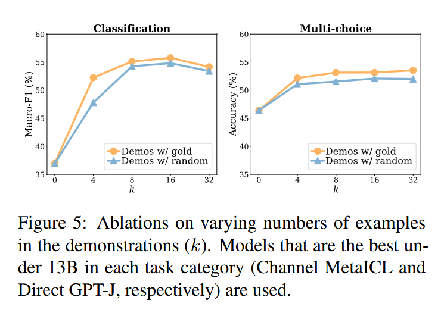

# [Rethinking the Role of Demonstrations: What Makes In-Context Learning Work?](https://arxiv.org/pdf/2202.12837)

## Meta

* Journal   - EMNLP
* Year      - 2021
* Author    - 
* Code      - 
* One liner - Random labels in ICL are surprisingly good and comparable to gold labels
* Model     - 
* Datasets  -
* Baselines - 

## Equations

## Proofs

## Algorithms

## Experiments
