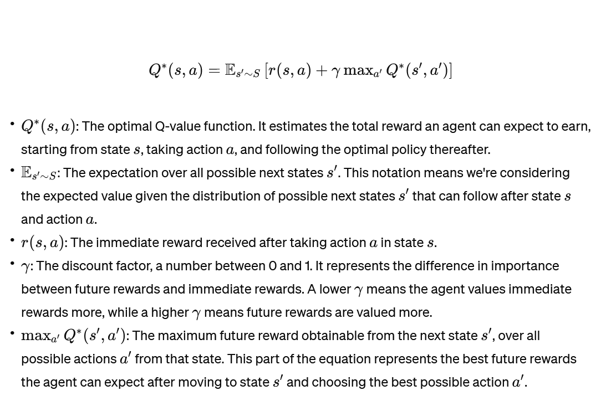

# [Active Example Selection for In-Context Learning](https://arxiv.org/pdf/2211.04486.pdf)

## Meta

* Journal - Conference on Empirical Methods in Natural Language Processing
* Year - 2022
* Author - University of Chicago
* Code - 
* One liner - 
* Model - GPT2, GPT3 (all sizes)
* Datasets - AGNews, Amazon reviews, SST-2, TREC

## Overview

## Training flow

### Data for off-policy RL training

1. Randomly select few shots and incrementally add them and record the confidence of correct answer
2. Few shot + prompt is state, next shot to select is action and confidence is reward

### Training policy network

1. Feed state and possible actions into a 3-layer MLP and let it predict the next action (shot) with highest reward

## Key takeaways

1. Chosing wrong ICL few shot can make the performance worse than random guessing.
2. Calibration did not produce significant improvements (Note: Very small models, Ada, babbage, GPT2)

## Questions

1. How is calibration applied in paper?

## Areas of improvement

1. Scale up the Q-network A LOT. Just use another LLM.
2. Let the policy network LLM just output the most relevant next shot.
3. Maybe also, calibrate its logits with the reward signal, so now it doubles as a Value model too.
