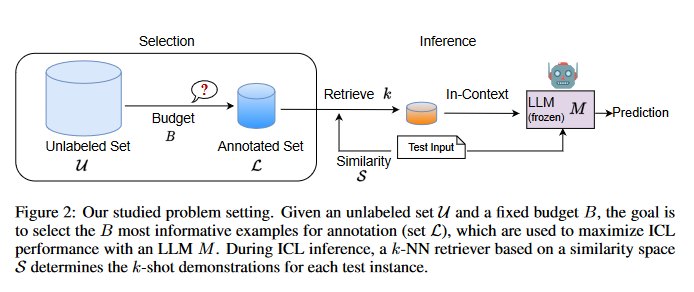
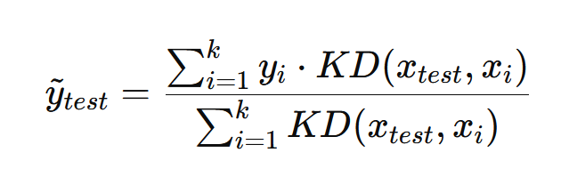

# [TODO] [WHICH EXAMPLES TO ANNOTATE FOR IN-CONTEXT LEARNING? TOWARDS EFFECTIVE AND EFFICIENT SELECTION](https://arxiv.org/pdf/2310.20046.pdf)

## Meta

* Journal -
* Year - 2023
* Author - Amazon
* Code - https://github.com/amazon-science/adaptive-in-context-learning
* One liner -
* Model - GPT-J, GPT-neo
* Datasets - AGNews, TREC, SST2, AmazonReviews, RTE, MRPC, MNLI, XSUM, GSM8k
* Baselines - Random, Pseudo labels, [Vote-k and fast vote-k](https://arxiv.org/abs/2209.01975), Least confidence

## Training flow



## Equations

### Independence assumption



* x_test - incoming question
* x_i    - i-th few shot query
* y_i    - i-th few shot label
* KD     - similarity kernel

The label predicted by a few shot is **assumed** to be the weighted average of the label predicted by independent 1-shots, where weights are similarity with incoming question.

### Max cover

```python
import numpy as np

# Mock data: 10 hard examples with initial weights of 1
hard_examples = np.ones(10)
# Number of selections (B) and iterations (T)
B = 5
T = 2
selection_per_iteration = B // T

for t in range(T):
    print(f"Iteration {t+1}")
    # Select examples based on their weights (here simply the highest weights, but in practice based on MAXCOVER)
    selected_indices = np.argsort(-hard_examples)[:selection_per_iteration]
    print(f"Selected examples: {selected_indices}")

    # Mark selected examples and reduce their weights for the next iteration
    for idx in selected_indices:
        hard_examples[idx] *= 0.1  # Reduce weight by a factor of 10
    
    print(f"New weights: {hard_examples}")

```

## Algorithms

### AdaICL base

```python
def adaicl_base(model, unlabeled_set, budget, similarity_space, initial_set=None, theta=0.5, k=5):
    if initial_set is None:
        labeled_set = []
    else:
        labeled_set = initial_set
    
    # Compute uncertainty scores for each example in unlabeled_set
    uncertainty_scores = []
    for example in unlabeled_set:
        k_shot_examples = retrieve_k_nearest_examples(labeled_set, example, k, similarity_space)
        uncertainty_score = get_uncertainty_score(model, example, k_shot_examples)
        uncertainty_scores.append((example, uncertainty_score))
    
    # Determine hard set based on scores and threshold theta
    hard_examples = [example for example, score in uncertainty_scores if score < theta]
    
    # Perform k-means clustering on hard_examples
    if not hard_examples:
        return labeled_set  # Return initial set if no hard examples
    
    # Convert examples to numpy array for clustering
    X = np.array([example for example in hard_examples])
    kmeans = KMeans(n_clusters=min(budget, len(hard_examples))).fit(X)
    centroids = kmeans.cluster_centers_
    
    # Select representative example for each cluster
    for centroid in centroids:
        cluster_examples = X[kmeans.labels_ == j]
        # Find the example closest to the centroid
        closest_index = np.argmin(np.linalg.norm(cluster_examples - centroid, axis=1))
        closest_example = cluster_examples[closest_index]
        labeled_set.append(closest_example)
    
    return labeled_set
```

### AdaICL

```python
TODO
```

### AdaICL plus

```python
TODO
```

## Experiments

* Budget vs 5-shot performance
* Accuracy vs generative model for each strategy
* Budget accuracy graph
* Calibration analysis
