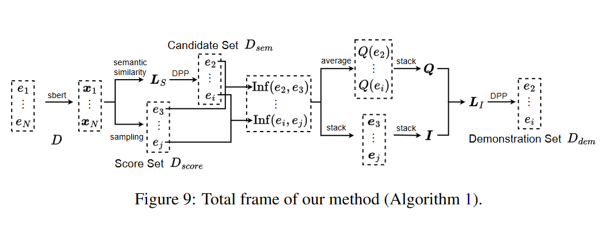

# [Representative Demonstration Selection for In-Context Learning with Two-Stage Determinantal Point Process](https://aclanthology.org/2023.emnlp-main.331.pdf)

## Meta

* Journal - Empirical Methods in Natural Language Processing
* Year - 2023
* Author - School of Artificial Intelligence, University of Chinese Academy of Sciences
* Code - 
* One liner - DPP once before running through generative LLM and once after to save costs
* Model - GPT2-xl, GPT-J, GPT-NeoX
* Datasets - SST2, TREC, CB, AGNEWS, DBPEDIA, RTE
* Baselines - [least confidence](https://arxiv.org/pdf/1906.11829.pdf), [contrastive active learning](https://arxiv.org/pdf/2109.03764.pdf), [K-means cot](https://arxiv.org/abs/2210.03493), [K-means-code](https://arxiv.org/abs/2304.07575), random, [DPP](https://arxiv.org/abs/2212.06800), [k-DPP](https://icml.cc/2011/papers/611_icmlpaper.pdf), [Greedy-DPP](https://proceedings.neurips.cc/paper_files/paper/2018/file/dbbf603ff0e99629dda5d75b6f75f966-Paper.pdf)

## Overview

### Inference algorithm



```python
import numpy as np
from numpy.linalg import det
import random

def shortlist_with_dpp(kernel_matrix, subset_size):
    """Selects a subset of items based on a simplified DPP-like mechanism."""
    # This is a heuristic approach for demonstration purposes
    indices = list(range(len(kernel_matrix)))
    selected_indices = []
    
    for _ in range(subset_size):
        # Calculate determinant for remaining indices and select the one that maximizes it
        max_det = 0
        best_idx = None
        for idx in indices:
            if idx in selected_indices:
                continue
            temp_indices = selected_indices + [idx]
            temp_kernel = kernel_matrix[np.ix_(temp_indices, temp_indices)]
            temp_det = det(temp_kernel)
            if temp_det > max_det:
                max_det = temp_det
                best_idx = idx
        if best_idx is not None:
            selected_indices.append(best_idx)
            indices.remove(best_idx)
    
    return selected_indices

def two_stage_dpp_selection(training_data, language_model, candidate_subset_size, score_set_size, demo_set_size, encode_sentence):
    """
    Two-Stage DPP Selection Algorithm.

    Parameters:
    - training_data: List of training examples.
    - language_model: Model to calculate sentence probabilities.
    - candidate_subset_size: Number of candidates in the subset.
    - score_set_size: Size of the score set.
    - demo_set_size: Size of the demonstration set.
    - encode_sentence: Function to encode sentences into vectors.

    Returns:
    - demonstration_subset: Selected subset for demonstration.
    """
    # Step 1: Encode all training examples
    encoded_examples = [encode_sentence(example) for example in training_data]

    # Placeholder for actual operations (e.g., calculating similarity matrix)
    similarity_matrix = np.stack(encoded_examples)  # Simplified example

    # Step 2: Select candidate subset (D_sem) based on a criterion
    candidate_subset = shortlist_with_dpp(training_data, candidate_subset_size)

    # Step 3: Random sampling from training data excluding candidate_subset
    remaining_data = list(set(training_data) - set(candidate_subset))
    score_subset = random.sample(remaining_data, score_set_size)

    # Step 4: Calculate influence scores for elements in candidate_subset
    influence_scores = np.zeros((len(candidate_subset), len(score_subset)))
    for i, candidate in enumerate(candidate_subset):
        for j, scored_item in enumerate(score_subset):
            # Placeholder for actual language model scoring
            influence_scores[i, j] = language_model.predict_proba(scored_item) - language_model.predict_proba(candidate, scored_item)

    # Step 5: Compute quality scores for each candidate
    quality_scores = influence_scores.mean(axis=1)

    # Step 6: Select demonstration subset based on a criterion
    demonstration_subset = shortlist_with_dpp(candidate_subset, demo_set_size)

    return demonstration_subset
```

# List of experiments

* Comparisons of the three factors: semantic diversity, instance quality, and influence diversity. We list the
4-shot performance on SST-2 for three LLMs: GPT2-xl (1.5B), GPT-J (6B), and GPT-NeoX (20B)
* 2-shot/4-shot/8-shot performance comparison on six datasets across three LLMs
* Effect of the three factors: semantic diversity (sem_div), instance quality (ins_qua), and influence diversity (inf_div).
* Transferability of representative demonstrations. We test the representative demonstrations selected based on GPT2-xl, GPT-J, and GPT-NeoX models on six different models GPT2-large, GPT2-xl, GPT-J, GPT-NeoX, text-davinci-002, and text-davinci-003. We show the average performance on Trec of 2-/4-/8- shots
* Effect of the subset size of SST-2 for GPT2-xl
