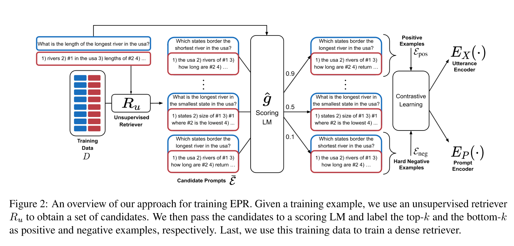
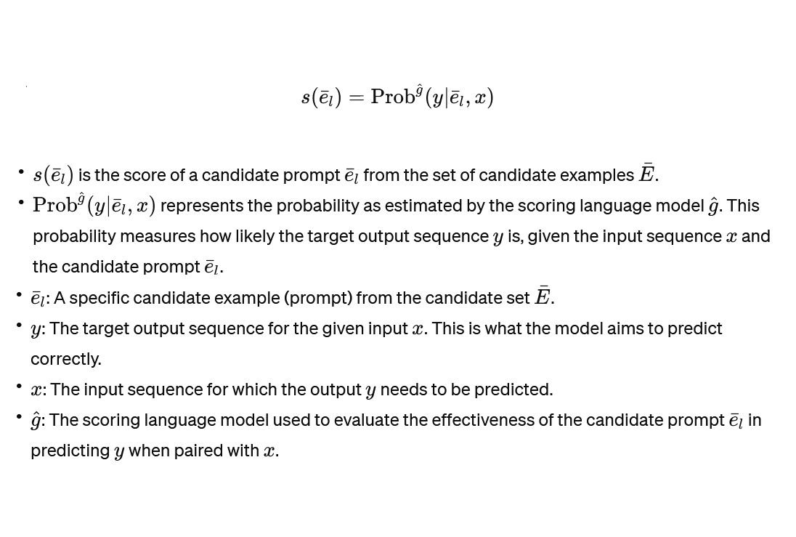
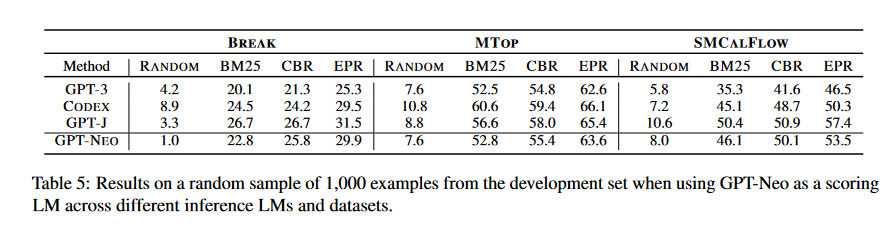

# [Learning To Retrieve Prompts for In-Context Learning](https://aclanthology.org/2022.naacl-main.191.pdf)

## Meta

* Journal - Conference of the North American Chapter of the Association for Computational Linguistics
* Year - 2022
* Author - Tel Aviv University
* Code - 
* One liner - Train a semantic search model to find things a generative LLM would find useful in context.
* Model - BERT-base, GPT3, CODEX, GPT-J, GPT-neo
* Datasets - break, mtop, smcalflow
* Baselines - random, sbert, bm25, bruteforce, CBR (https://arxiv.org/abs/2104.08762)

## Overview

