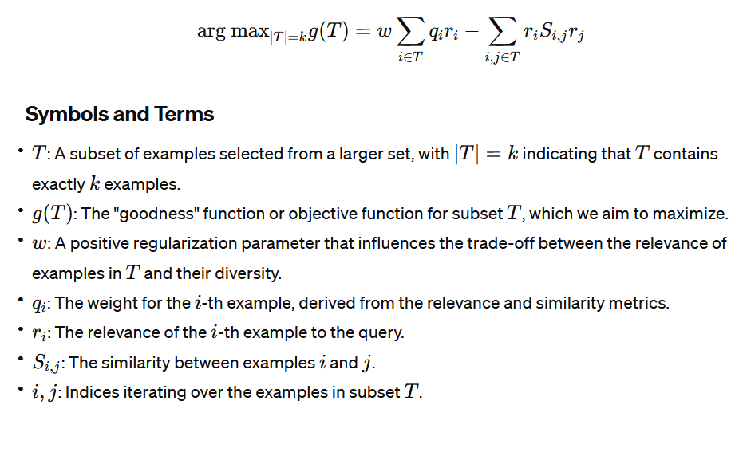

# [TODO] [GenDeR: A Generic Diversified Ranking Algorithm](https://www.cs.rpi.edu/~szymansk/papers/nips.12.pdf)

## Meta

* Journal - Neurips
* Year - 2012
* Author - IBM T.J. Watson Research, University of Michigan, Rensselaer Polytechnic Institute
* Code -
* One liner - Facility location
* Model -
* Datasets - IMDB network, ACL Anthology Network,
* Baselines -

## Overview

### Training flow



TODO

### Algorithm

```python
import numpy as np

def gender_algorithm(similarity_matrix, relevance_vector, weight, budget):
    # Compute the reference vector
    reference_vector = similarity_matrix @ relevance_vector
    
    # Initialize the selected nodes set as empty
    selected_nodes = set()
    
    # Initialize the score vector
    score_vector = weight * (reference_vector * relevance_vector) - np.diag(similarity_matrix) * relevance_vector * relevance_vector
    
    # Selection loop
    for _ in range(budget):
        # Find the index of the maximum score not already selected
        scores = {j: sj for j, sj in enumerate(score_vector) if j not in selected_nodes}
        max_score_index = max(scores, key=scores.get)
        
        # Add the index with the maximum score to the selected nodes set
        selected_nodes.add(max_score_index)
        
        # Update the score vector
        score_vector -= 2 * relevance_vector[max_score_index] * similarity_matrix[:, max_score_index] * relevance_vector
    
    # Return the subset of selected nodes as a list
    return list(selected_nodes)

# Example usage
num_nodes = 10  # Assume there are 10 nodes
similarity_matrix = np.random.rand(num_nodes, num_nodes)  # Example similarity matrix
relevance_vector = np.random.rand(num_nodes)  # Example relevance vector
weight = 2  # Example weight
budget = 5  # Number of nodes to select

selected_nodes = gender_algorithm(similarity_matrix, relevance_vector, weight, budget)
print("Selected nodes:", selected_nodes)
```

### Inference flow

TODO

## List of experiments

* Coverage vs k

## List of proofs

* Objective function is NP hard
* Diminishing returns property of objective function
* Near optimality of objective function
* Time complexity
