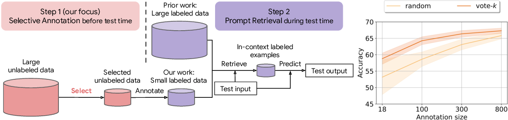

# [SELECTIVE ANNOTATION MAKES LANGUAGE MODELS BETTER FEW-SHOT LEARNERS](https://arxiv.org/pdf/2209.01975.pdf)

## Meta

* Journal -
* Year - 2022
* Author - The University of Hong Kong, University of Washington, Allen Institute for AI, Penn State University, Carnegie Mellon University, Meta AI
* Code - https://github.com/HKUNLP/icl-selective-annotation
* One liner - Deduplication with exponential push away force
* Model - GPT-Neo, GPT-J, GPT-3, [SBERT](https://aclanthology.org/D19-1410.pdf)
* Datasets - MRPC, SST5, DBpedia, MNLI, RTE, HellaSwag, MWoZ, GeoQuery, NQ, XSUM, CivilComments, Amazon Reviews
* Baselines - random, votek, maximum facility location, diversity, least confidence, fast vote-k, votek

## Overview

### Inference flow



1. For all embeddings find the top K most similar embeddings
2. Keep track of who voted for whom
3. Each supporting document casts a vote, the more votes it casts, the less its strength of voting. Exponential decay. (no ablation provided to justify the exponential mechanism)
4. Pick the top most voted items.

### Algorithm

```python
import numpy as np
from sklearn.metrics.pairwise import cosine_similarity


def select_samples(samples, num_to_select, language_model):
    """
    Select a subset of samples based on the Voke-k Selective Annotation algorithm.

    Parameters:
    - samples: List of sample embeddings.
    - num_to_select: Total number of samples to select.
    - language_model: A model providing a scoring function for sample selection.
    """
    num_samples = len(samples)
    selected = set()
    unselected = set(range(num_samples))
    cosine_sim_matrix = cosine_similarity(samples)
    
    # Function to calculate s(v)
    rho = 2  # Assumed value, adjust as needed

    def s(v, selected_indices, edges):
        return rho - sum(1 for _l in selected_indices if (_l, v) in edges)

    # Build the k-nearest neighbors graph
    k_nearest_neighbors = {i: set(np.argsort(cosine_sim_matrix[i])[-k:]) for i in range(num_samples)}

    # Initial selection process
    while len(selected) < num_to_select // 10:
        u_star = max(
            unselected, 
            key=lambda u: sum(
                s(v, selected, k_nearest_neighbors[u]) 
                for v in k_nearest_neighbors[u] 
                if v in unselected
            )
        )
        selected.add(u_star)
        unselected.remove(u_star)

    # Score calculation for the remaining samples
    scores = {u: language_model.score(samples[u]) for u in unselected}  # Placeholder for actual LM scoring function

    # Further selection in batches
    unselected = list(unselected)  # Convert to list for slicing
    for j in range(1, 10):
        batch_indices = unselected[(j - 1) * len(unselected) // 10 : j * len(unselected) // 10]
        for i in range(len(batch_indices)):
            u_star = max(
                batch_indices, 
                key=lambda u: sum(
                    s(v, selected, k_nearest_neighbors[u]) 
                    for v in k_nearest_neighbors[u] 
                    if v in batch_indices
                )
            )
            selected.add(u_star)
            batch_indices.remove(u_star)

    return selected
```

## List of experiments

* Baselines + result vs datasets
* Annotation size vs accuracy for 3 datasets
* LM size scaling vs accuracy
* CivilComments, Amazon Reviews cross domain generalization
