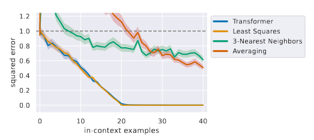

# [What Can Transformers Learn In-Context? A Case Study of Simple Function Classes](https://arxiv.org/pdf/2208.01066.pdf)

## Meta

* Journal - Arxiv
* Year - 2024
* Author - Stanford
* Code - https://github.com/dtsip/in-context-learning
* One liner - A transformer finetuned to do linear regression in context, is good at doing linear regression in context.
* Model - GPT2 (similar)
* Datasets - Synthetic

## Findings

### Linear regression



If you finetune an LLM for doing linear regression, Y = W @ X, it can predict W from incontext examples. The accuracy increases with shots.

e.g.

Input

```
x1: [0.1846, 0.2599, 0.7818], y1: -0.8751
x2: [-1.2370, -1.3205, 0.5219], y2: -2.8464
x3: [0.2970, 0.2505, 0.3464], y3: -0.1619
x4: [-0.6800, 0.2323, 0.2931], y4:
```

Output

```
-0.3222
```
