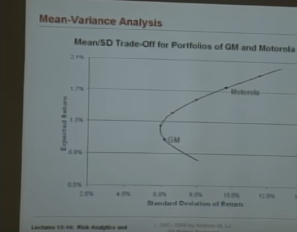
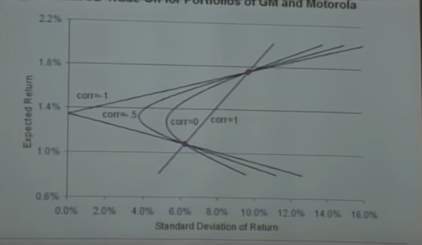
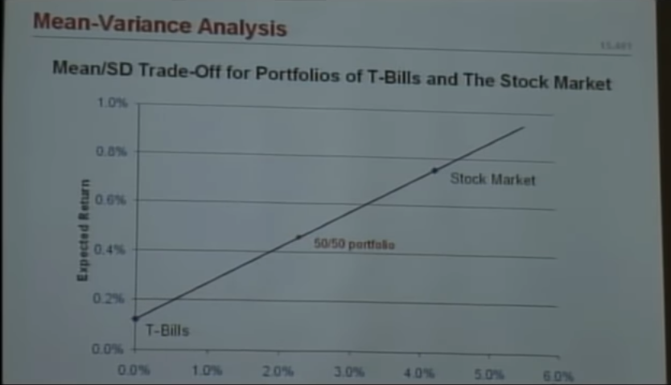
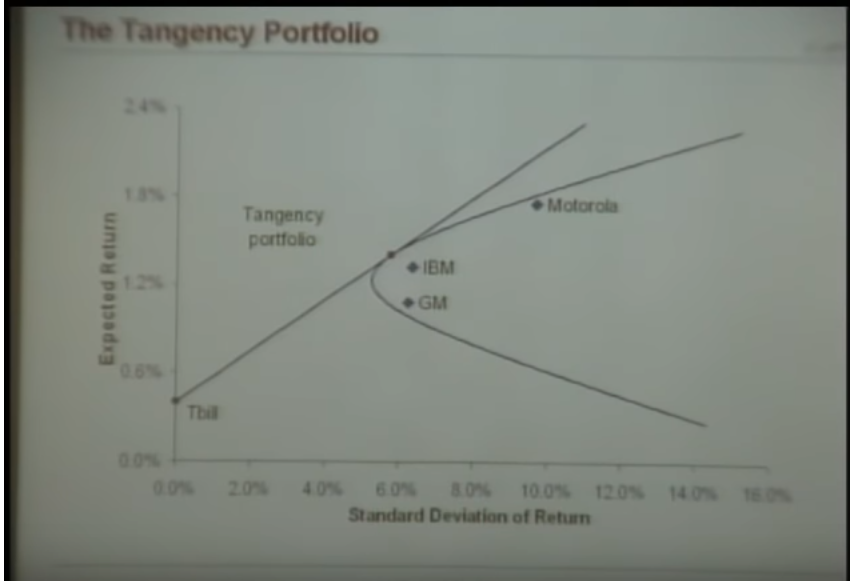
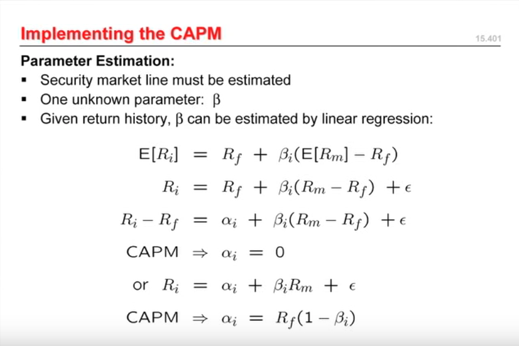

# [MIT 15.401 Finance Theory I, Fall 2008](https://www.youtube.com/playlist?list=PLUl4u3cNGP63B2lDhyKOsImI7FjCf6eDW)

## 1. Introduction

.

## 2. Present Value Relations 1

Asset
- sequence of future cashflows
- Anything that can be made into money
- Patents - assets out of ideas

Value of asset
`V(A) = (t[1]/t[0])V(A[1]) + ... + (t[n]/t[0])V(A[n])`
`V(A) = exchange_rate_vector . value_vector`

Impatience = The loss of value with time (should not be confusted with inflation)

Supply-Demand - More people want money today than tomorrow

## 3. Present Value Relations 2

Time value of money - Exponential decay

Perpetuity

`PV = C/(1+r) + C/(1+r)^2 + ...`
`PV = C / r`

Growth

`PV = C/(1+r) + C(1+g)/(1+r)^2 + ...`
`PV = C / (r - g), r > g` 

Annuity - PV after time T

Equivalent to purchasing a perpetuity and then selling it at `t+1`. **Indexing starts at 1**

`PV = C/r - (C/r) * (1+r)^-t`

Effective Annual Rate
EAR = (1+r/n)^n - 1

## 4. Present Value Relations 3

Mark to market - Establish a market price of an asset by querrying the market.

Increase in cost of living, I is inflation
```
= I[t + k]/I[t] 
= (1 + p) ^ k
```

Real wealth after k years 
`= W[t + k] / (1 + p) ^ k`

Real return
```
= W[t + k]/(W[t] * (1 + p) ^ k)
= (1 + r_nominal) / (1 + p) - 1
= r_nominal - p
r_real = r_nominal - p
```

Equity = Assets - Liabilities

Asset = Something you have
Liabilities = Something you owe

Futures = Financial contracts obligating the buyer to purchase an asset or the seller to sell an asset, such as a physical commodity or a financial instrument, at a predetermined future date and price.

Liquidity decreases with complexity of figuring out the market value of an asset.

Loan = money to borrow
Margin = A collateral the borrower has to give to the lender (broker)
Leverage = Purchasing more stocks than what the portfolio holder has, where the borrowable amount is scaled by the amount of money the holder has.

Derivative = Any asset whose value depends on the underlying set of assets is called a derivative

Coupon bonds = A bond which gives the bearer `x%` of its value every year (similar to dividend).

## 5. Fixed income securities 2

Investment grade assets = ?

`R[t]` = rate of interest at year `t` (Spot rate)

```
P = F / ((1 + R[1]) (1 + R[2]) ... (1 + R[T]))

let r = geometric_mean(1 + R) - 1
P = F / (1 + r) ^ T

P[t - 1] / P[t] = 1 + R[t]
R[t] is called forward rate
```

Coupon bonds

```
P = F/(1+R[1]) +  F/((1+R[1])(1+R[2])) +  F/((1 + R[1]) (1 + R[2]) ... (1 + R[T])))

y = r

r needs to be determined numerically
```

Expectation hypothesis: Expected Future Spot
```
E[0](R [k]) = f[k]
```
## 6. Fixed income securities 3

Yield curve = graph of interest rate vs maturity date (borrowing period)

Arbitrage = free lunch

Macaulay duration = Duration the investor is exposed to risk

Second order derivative of yield curve is volatility

## 7. Fixed income securities 4

**Securitization** - Polarising the risks of multiple *uncorrelated* bonds so that we can entice investors with both high risk and low risk appetite. 

Let there be two bonds, 1000 each, with 10% default risk.

The success matrix

| Event | Chance | Payout |
|-------|---------|-----------|
| Both succeed | 81% | 2000 |
| One succeeds | 18% | 1000 |
| Both fails   | 1% | 0 |

We as bond issuers issue both bonds but we have a special policy. For a premium, the investor can buy a hypothetical bond. Such that if one of the bonds, succeed, then he gets a payout. Or, he can buy another policy where he gets paid only if both bonds succeed. What should be the price of these two hypothetical bonds?

Senior Tranche = Probability of payout * payout = 99% * 1000 = 990
Junior Tranche = 81% * 1000 = 810

For perfectly correlated bonds

| Event | Chance | Payout |
|-------|---------|-----------|
| Both succeed | 81% | 2000 |
| Both fails   | 19% | 0 |

## 8. Equities

Equity = Part ownership in a corporation

Limited Liability = The most you can loose is the money you put in.

Short sale = Selling your asset before you default

Primary market = Venture capital, IPO

Secondary market = Stock exchanges

```
P[t] = Price of stock at t
D[t] = Cash dividend at t
E[t]() = Expectation operator (forecast) at t
r[t] = Risk adjusted discount rate for cashflow at t

P[t] = V[t](D[t + 1], D[t + 2], ...)
= E[t](D[t + 1]) / (1 + r[t + 1]) + E[t](D[t + 2]) / (1 + r[t + 2])^2 + ...

P[t] = sum(E[t](D[t + k]) / (1 + r[t + k]) ^ k, k = 1 to inf)
```

Assuming

```
D[t] = D
r[t] = r

P[inf] = P = D/r

with growth
P = D/(r - g)
```

## 9. Forward and Futures Contracts 1

**Forward/Futures contract** = A legal binding contract that a transaction will take place at some time in future.

Forwards contract only works when both buyer and seller think neither are losing value. Therefore the contract itself has no value.

Forwards are used to eliminate uncertainity. Lock in a price.

Forwards are useful when you want to buy something now but dont want to store it physically right now.

Futures = Every sub period of market fluctuations the parties pay the deviation from the market price and the agreed value. In this way they mitigate counterparty risk.

## 10. Forward and Futures Contracts 2 and Options 1

Futures/Forwards price at time t = Buying the same amount at t=0 and then paying for storage for time t

```
F[t,T] / (1 + t) ^ (T - t) = P[t] + S[t]
```

Since stocks are very correlated, you can short sell the SNP500 and achieve the same effect as selling your portfolio.

Options = Futures but you can cancel the deal at any time

Put = Selling Options
Call = Buying Options

Put options are insurances but unlike insurances you can cash in any time. Also, they can be bought and sold on the exchange.

Early excercise = Early selling

## 11. Options 2

### Call option

Payoff diagram: Payoff vs stock price

Payoff diagram at maturity date. Dotted line is premium for the option.


If the value of stock price `< 20$` at maturity then the payoff is zero.

The value of a option before maturity is non zero even if the stock price `< 20$` due to its potential.

### Put option

Sell the stock before


Max payoff is bounded `10$`

Insurances are put options

### Option Strategies

#### Call + Put


#### Call - Call


Options price and volatility are related

### Corporate liabilities

V = ?
B = ?

Equity = V - B + Max (0, B - V)

Debt = B - Max(0, B - V)

V = Debt + Equity

### Other

Labor markets with fixed tenure look like options: After the fixed amount of money for the tenure, there are no more liabilities. 

Education is an option: After the payment of the education fees, there are no more liabilities.

## 12. Options 3 and Risk and Return 1

`S[0]` = Stock price right now

K = Strike price

Option expires tomorrow 
`C[1] = max(s[1] - K, 0)`

Suppose `S[0] -> S[1]` is Bernoulli trial


B = Bonds
r = Growth rate (e.g. 1.03)

`V[0] == S[0]\delta + B`

```
V[1]
= uS[0]\delta + rB = C[u] (with probability p)
or
= dS[0]\delta + rB = C[d] (1 - p)
```


Notice: There is no p in the formula

Buyer and seller have two different p but can agree on the price of the option.

```
d < r < u
```

If r < d then nobody would ever buy B because the rate of riskless borrowing is less than the lowest payout of riskful borrowing.

If r > u then the risk free borrowing is better than the riskful borrowing.


### Risk and Return

```
Return = R[i][t] = (D[i][t] + P[i][t] - P[i][t-1]) /  P[i][t-1]

Expected Return = E(R[i][t])

Excess Return = R[i][t] - r[f]

Risk Premium = E(R[i][t]) - r[f]
```

## 13. Risk and Return 2 & Portfolio Theory 1

Sine wave is not a good model for a market. Because as soon as people take advantage of a pattern. It changes.

Efficient market is random. If it is not random, it means there are not enough people trying to find the patterns.

> Stocks are random walks with drift

*TODO: Read about the january effect*

*TODO: Read about the P/B to returns*

### Portfolio

```
w = { w1, w2, ..., wn }

w[i] = N[i]P[i] / sum(N[i]P[i])

1 = w1 + w2 + ... + w3

w[i] belongs to R

if w[i] < than 1 then short selling
if w[i] > 1 then leverage
```

Good portfolio = High mean low std

## 14. Portfolio Theory 2

```
Mean = E(Ri) = u[i]
Variance = Var(R[i]) = s ^ 2

R[p] = sum(w[i]R[i])
E(R[p]) = sum(w[i]u[i]) 

Var(R[p]) 
= E((R[p] - u[p]) ^ 2)

E(w[i][j](R[i] - u[i])(R[j] - u[j])) 
= w[i]w[j] Cov(R[i],R[j])
= w[i][j]s[i]s[j]p[i,j]
```

**Vector notation**

```
w = Weight vector
R = Portfolio matrix [stock_index, historical_prices]
u = Mean value of each stock in portfolio
E(R) = w . u
Var(R) = reduce_sum(hadamard_product((w * wT), Cov(R)))
```

There are n variances and `n^2 - n` covariances

Individual variances dont matter as much as covariances.

### Risk return curve



### Risk return curve - Effects of correlation between stocks



### Risk return curve - Treasury bills vs stocks



Efficient frontier = It makes no sense to get more risk for the same return.

## 15. Portfolio Theory 3 & The CAPM and APT 1

### Tangency portfolio

There is only one portfolio that can be mixed with T bills that lies on the efficient frontier and that point is the tangent line from T bills to the efficient frontier.



* If you choose a slope lesser the tangent point then there exists another point which gives greater return for the same risk.
* Does this assume that our objective function is = 1 * returns + (-1) * risk
* Indifference curve will be a curve passing through the tangency point.

### Sharpe ratio

```
Sharpe ratio = (E(R[p]) - r[f]) / s[p]
```

* Higher is better.
* Tangency portfolio has the highest sharpe ratio of any portfolio.
* Alpha = risk adjusted performance
* `r[f]` is subtracted from `E(R[p])` because that is the lowest amount of returns you can expect from any investment?

### Capital Asset Pricing Model

Efficient portfolios

```
f = risk free investments
m = market
p = portfolio
s = std dev = risk

E(R[p]) = R[f] + (s[p] / s[m]) (E(R[m]) - R[f])
```

Market beta for an asset
```
B[i] = Cov(R[i], R[m]) / Var(R[m])
```

Sharpe-Lintner CAPM

```
E(R[i]) = R[f] + B[i] (E(R[m]) - R[f])
```
* Risk-reward relation is linear
* Beta is the correct measure of risk instead of sigma

## 16. The CAPM and APT 2

```
B[p] = w . B
```

Beta is linear

B is a measure of riskiness

> Sigma is the right measure of risk only for efficient portfolios. For all other portfolios, Beta is the right measure of risk.

*TODO: Read about exotic Betas*



## 17. The CAPM and APT III & Capital Budgeting I

```
CF = inflows - outflows
= operating revenues
- operating expenses without depreciation
- Capital expenditures
- income tax

operating profit = operating income - operating expenditure

project income taxes = tax rate * operating profit
- tax * depreciation

CF = (1 - tax) * operating profit 
- capital expenditures
- tax * depreciation
```

You dont get income tax returns on your entire capital investment in the same year you purchased it. It is given back using depreciation.

Accounting earnings =/= after tax net cash flow

Hedge fund are very risky. Their future returns are greatly undervalued

Beta is the systematic risk. Beta correlates with returns.

## 18. Capital Budgeting 2 and Efficient Markets 1

### Payback period: How much time until I get return of investment
- ignores time value of money
- ignores cashflows after k

```
sum((CF[i] / (1+R[i])), 1, k) >= -CF[0] = I[0]
```

### Profitability index: Gross rate of return
- ignores scale (2$:1$ =/= 2mil$:1mil$)

```
PI = PV / (-CF[0])
```

### Internal rate of return
- only one deposit
- no negative cash flows
- only one project under consideration
- Rate = opportunity cost of capital
- IRR may not exist
- There may be multiple IRR (roots might be complex)
- ignores scale

```
I[0] = sum(CF[i] / (1 + IRR) ^ i)

Solve for IRR
```

Take project with greatest IRR

### Efficient markets says
- No free lunch
- Prices reflect all available info
- Prices follow random walks
- Tradeoff between risk and expected return
- Active management does not add value

## 19. Efficient Markets 2

uncertainity =/= risk

uncertainity = unquantifiable risk

### Dutch book theorem

Event A = S&P 500 falls 5% or more next monday

Believes

Prob(A) = 1/2
Prob(!A) = 3/4

This implies that you will take bets

B1 = 1$ if A and -1$ if !A
B2 = 1$ if !A and -3$ if A

#### I place 50$ on B1 and 75$ on B2

If A occurs: I lose 50$ on B1 and win 75$ on B2
If !A occurs: I lose 25$ on B2 and win 50$ on B1

### Behavioral vs rational

Frontal lobe damage
- No impact on IQ or memory
- But became irrational
- Depression

Pain makes you stupid because blood diverted from brain doing higher order functions to parts of brain doing lower order functions.

### Adaptive market hypothesis

- Risk/reward relation is not stable (non-linear)
- Risk premia are time varying
- Limited arbitrage exists from time to time
- Stragies wax and wane
- Adaptation and innovation are keys to survival
- Survival is all that matters
