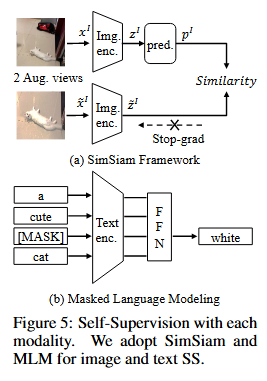

# [SUPERVISION EXISTS EVERYWHERE: A DATA EFFICIENT CONTRASTIVE LANGUAGE-IMAGE PRE-TRAINING PARADIGM](https://arxiv.org/pdf/**pdf)

**Source Code:** [Github](https://github.com/Sense-GVT/DeCLIP)

**Datasets:** Conceptual Captions (CC3M), Conceptual 12M (CC12M), YFCC (Yahoo Flickr Creative Commons), DeCLIP Open-Source Data, DeCLIP Web-Crawled Data, DeCLIP Full Data, PETS, CIFAR10, CIFAR100, Food101, flowers, caltech, aircraft, imagenet1k, SUN, stanford CARS, DTD

**Author:** SenseTime Research, The University of Texas at Austin, University of Sydney

**Journal:** ICLR

**Year of Submission:** 2022

## What problem does it solve?

Better CLIP

## How does it solve it?

### Self supervision signals

#### unimodal self supervision

The SimSiam (Simple Siamese) framework is a method for self-supervised learning in the field of computer vision. It's designed to learn useful representations of images without relying on labeled data. Here's how it works:

* **Pair Creation**: SimSiam starts by creating pairs of augmented views from the same image. These augmentations might include changes in color, cropping, or flipping, ensuring that the two views are different but still represent the same underlying content.

* **Feature Extraction**: Both views are passed through a neural network (typically a CNN) to extract features. This network is called the encoder.

* **Projection and Prediction**: The features from one view are projected and then predicted to match the projection of the other view. This involves a projection head (a small neural network) followed by a prediction head.

* **Objective**: The key objective of SimSiam is to maximize the similarity between the projected and predicted features of the two views. This is achieved without using negative pairs, which is a significant departure from other contrastive learning methods like SimCLR or MoCo.

* **Stop-Gradient**: An essential component of SimSiam is the use of a stop-gradient operation on one branch of the siamese network. This prevents collapsing solutions, a common problem in siamese networks, where the network outputs trivial solutions.

By learning to predict features of one view from another, SimSiam encourages the network to learn representations that capture the essential aspects of images, useful for various downstream tasks like classification, detection, or segmentation.

#### Text self supervision

Here, random words in a sentence are masked (hidden), and the model is trained to predict these masked words correctly, thereby understanding the sentence's overall semantic content.

### multimodal self supervision

image is paired with multiple augmented texts

text is paired with multiple augmented images

### KNN supervison

augmented image to caption and nearest neighbours of caption

model is not frozen, it might reinforce mistakes

## Implementation details

* DeCLIP-ResNet50 and DeCLIP-ViT-B/32 trained from scratch for 32 epochs.
* Uses 88M image-text pairs for training.
* Image encoder input resolution: 224 × *
* Maximum context length for the text encoder: *
* Learnable temperature parameter τ initialized at **
* Loss weights (α, β, γ) for additional supervision are all set to **

## Similar papers

Here are the citations from the specified text, stripped of non-specific descriptors:

* **Krizhevsky et al., 2012**: Introduces deep convolutional neural networks in computer vision.
* **Simonyan & Zisserman, 2014**: Discusses convolutional neural networks for image classification.
* **He et al., 2016**: Presents ResNet, a deep learning model for image recognition.
* **Deng et al., 2009**: Describes ImageNet, a large visual database for training neural networks.
* **Girshick et al., 2014; Long et al., 2015; Vinyals et al., 2015**: Applies pre-trained CV models to various downstream tasks.
* **Devlin et al., 2018**: Introduces BERT, a Transformer model in natural language processing.
* **Radford et al., 2019**: Discusses language models at the intersection of NLP and CV.
* **Brown et al., 2020**: Related to large-scale language models in NLP.
* **Radford et al., 2021**: Presents CLIP, a model using image-text pairs with contrastive loss.
* **Jia et al., 2021**: Discusses ALIGN, a model leveraging image-text pairs.
* **LeCun & Misra, 2021**: Explores structural information within data modalities for self-supervision.
* **He et al., 2020; Chen et al., 2020a**: Focus on self-supervision in learning representations.
* **Caron et al., 2020**: Introduces multi-crop strategies in images for self-supervised learning.
Here are the citations from the provided text along with a brief description for each:
* **Han et al., 2021**: Discusses pre-training for extracting general knowledge from large datasets for versatile tasks.
* **Devlin et al., 2018; Brown et al., 2020**: NLP models leveraging large-scale language data for high performance.
* **Girshick et al., 2014; Long et al., 2015; Vinyals et al., 2015**: CV models' success in downstream tasks, despite scaling challenges.
* **Joulin et al., 2016; Gomez et al., 2017; Zhang et al., 2020; Sariyildiz et al., 2020; Desai & Johnson, 2021**: Efficacy of language supervision in learning visual features.
* **Radford et al., 2021; Jia et al., 2021**: CLIP and ALIGN models learning from vast image-text pairs.
* **Mu et al., 2021; Yao et al., 2021; Wu et al., 2021; Cheng et al., 2021**: Enhancements to CLIP and methods for noise reduction in datasets.
* **LeCun & Misra, 2021; He et al., 2020; Chen et al., 2020a; Caron et al., 2020; Grill et al., 2020; Chen et al., 2020b; Yuan et al., 2021**: Self-supervised learning and contrastive learning in visual and multi-modal settings.
* **Dwibedi et al., 2021; Van Gansbeke et al., 2021**: Nearest-neighbor supervision for learning visual features.
* **Chen et al., 2020b; Lu et al., 2019; Li et al., 2020; Shen et al., 2021; Akbari et al., 2021**: Various approaches in multi-modal learning, including cross-modal transformers and their application in tasks like VQA and image captioning.
