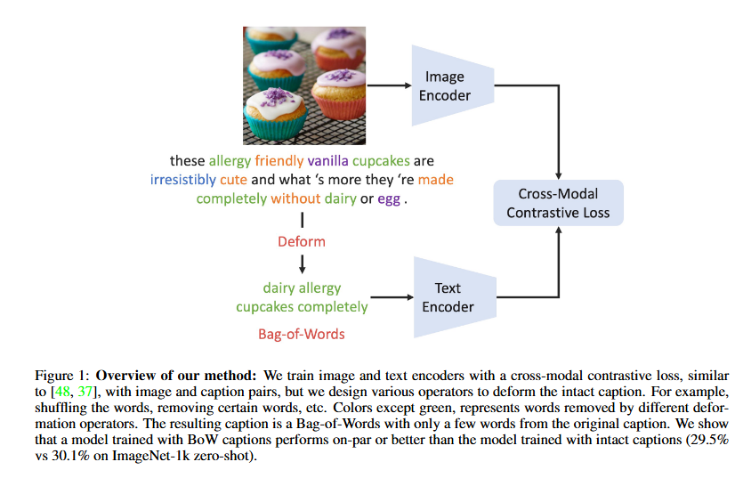
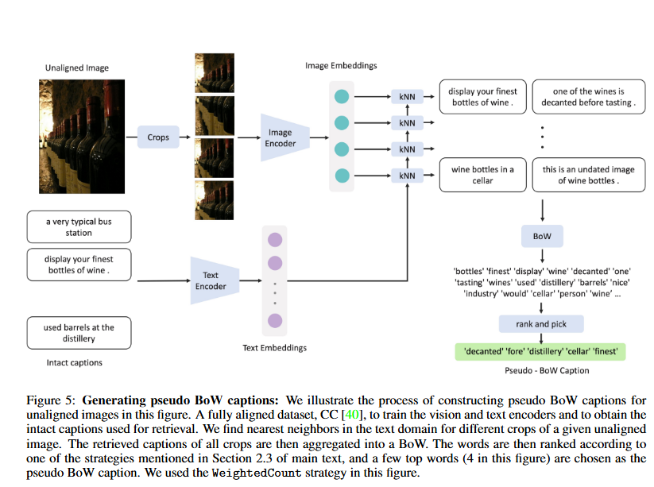

# [A FISTFUL OF WORDS: LEARNING TRANSFERABLE VISUAL MODELS FROM BAG-OF-WORDS SUPERVISION](https://arxiv.org/pdf/2112.13884.pdf)

**Source Code:** ???

**Datasets:** ImageNet-1k (IN1k-ZS), Food101, SUN397, CIFAR100, Flowers102, Pets, Caltech-101, DTD (Describable Textures Dataset), Conceptual Captions (CC)

**Author:** Meta

**Journal:** ???

**Year of Submission:** 2022

## What problem does it solve?

Better CLIP

## How does it solve it?

### Training flow

1. Take CLIP
2. Data augment the caption
3. Train normally

### Augmentation strategies

1. **Shuffle**: Rearranges words in a caption to remove syntactic structure, converting text into a Bag-of-Words (BoW) format.
2. **RmStopNalpha**: Eliminates stop words and non-alphabetical elements from captions, focusing on words that are more directly related to the image content.
3. **LimitToBaseVocab**: Constrains the vocabulary in captions to words found in a base subset of captions, reducing word diversity.
4. **RmTopFreq(t)**: Deletes the top-t most frequent words from captions to balance word distribution and focus on less common terms.
5. **Keep(n)**: Retains only the first n words of a caption, used in conjunction with other operations to keep a few random words from the original caption.

### Utilizing Unaligned Images

For images without a caption, run a KNN on the labled dataset with image as query and associated label as output.

### Model

CLIP

## How is this paper novel?

> In summary, we discover that image captions with intact natural language structure are redundant for training vision models for zero-shot classification. In fact, deforming most of the text captions and turning them into BoW can even lead to improvements

## List of experiments

* Intact Captions vs. Bag-of-Words
* Utilizing Unaligned Images

## Implementation details

* **Framework**: Implemented using PyTorch.
* **Optimizer**: SGD with a weight decay of 0 and momentum of 0.9.
* **Batch Size**: 512.
* **Learning Rate**: Uses cosine learning rate decay, starting from 0.003.
* **Hardware**: Trained on 8 A100 GPUs.
* **Training Duration**: Approximately 18 hours for 20 epochs on the full 2.9M Conceptual Captions (CC) dataset.
* **Temperature**: Set to 0.02.
* **Memory Bank Size**: Default size is approximately 8192 (∼ 8k).
* **Vision Encoder**: A linear layer is used on top of it to match the dimension of text embeddings (typically 768), with the vision encoder being ResNet-50 (dimension 2048 × 768).
* **Embedding Pooling**: Average pooling is used for creating a single sentence-level embedding from a list of tokens.
* **Pooling Method Ablation**: Compared average pooling with [CLS] pooling, finding no noticeable difference in performance.

## Similar papers

Here's a summary of each cited paper in Section 4 "Related Works" of the document:

* **[41] & [42]**: Studies text deformation in natural language understanding tasks.
* **[47]**: Discusses self-training in the context of semi-supervised learning.
* **[5]**: Pertains to the literature of semi-supervised learning.
* **[20]**: Utilizes both paired and unpaired data for image captioning.
* **[21]**: Related to cross-modal retrieval between images and text.
* **[10] (BERT-style transformer model)**: A foundational model deeply fusing representations from both vision and language modalities.
* **[27] (VisualBERT)**: Focuses on early fusion of vision and language representations.
* **[32] (ViLBERT)**: Delays fusion of modalities until later layers.
* **[26] (ALBEF)**: Uses contrastive loss for improved alignment in V&L features.
* **[2]**: Improves the masked-language-modeling component of VLP.
* **[33] (12-in-1)**: Enhances fine-tuning by multi-task training on 12 tasks.
* **[28] (U-VisualBERT)**: Explores the removal of paired vision and language data in pre-training.
* **[13]**: Investigates the use of cross-modal cues by deforming individual modalities.
* **[4]**: Offers a comprehensive overview of vision and language pre-training.
* **[45] (ZSL)**: A complete overview of zero-shot learning.
* **[24] (DAP)**: Uses semantic attribute classifiers in ZSL.
* **[14] & [43] (DeViSE)**: Aligns image and word features in ZSL.
* **[37] (CLIP)**: Defines ZSL as generalization to novel image recognition datasets, using large-scale datasets.
* **[18] (ALIGN)**: Scales up pre-training dataset to 1B data points.
* **[7]**: Proposes a distillation-based loss for dataset noise handling.
* **[44] (Efficient-CLIP)**: Uses text-only data for unimodal MLM tasks.
* **[1] (DeCLIP)**: Incorporates multiple unimodal SSL losses and noise reduction in negatives.
* **[19]**: Focuses on training visual features by predicting BoW tags associated with images.
* **[25]**: Extends [19] to predict n-grams instead of individual words.
* **[9] (VirTex)**: Uses generative modeling of text for efficient visual feature training.
