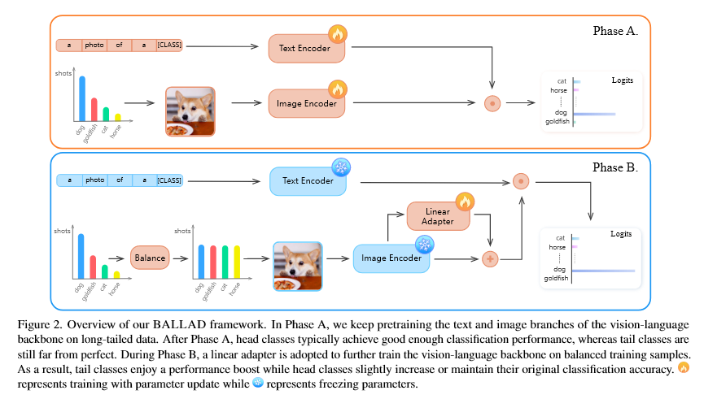

# Quick papers

## [A Simple Long-Tailed Recognition Baseline via Vision-Language Model](https://arxiv.org/pdf/2111.14745.pdf)

1. Take CLIP
2. In for each mini-batch, balance the class labels
3. Finetune adapters

## [K-LITE: Learning Transferable Visual Models with External Knowledge](https://arxiv.org/pdf/2204.09222.pdf)

1. Take CLIP
2. Concat each label with wordnet/wikitionary definition and feed that to the text encoder
3. Finetune it

## [Data-Efficient Language-Supervised Zero-Shot Learning with Self-Distillation](https://arxiv.org/pdf/2104.08945.pdf)

We take an exponential moving average model and a student model of CLIP

We have two losses

- The first loss is the loss of matching image and text using InfoNCE loss (negative average log of the rows of the similarity matrix)
- The 2nd loss is the KL divergence of the rows of the similarity matrix between the teacher and student model

The training flow will be

1. Take two clip models, teacher and student
2. Train with two losses mentioned (weighted addition hyperparameter)
3. Periodically update the teacher model
