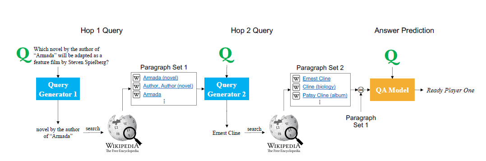

# [Answering Complex Open-domain Questions Through Iterative Query Generation](https://arxiv.org/abs/1910.07000)

**Source Code:** [Github](https://github.com/qipeng/golden-retriever)

**Datasets:** HOTPOTQA, QAngaroo

**Time to read:** ?

**Author:** Stanford

**Year of Submission:** 2019

## What problem does it solve?

Sometimes one search is not enough to get all the information from a query.
So, it must learn to query multiple times.

## How does it solve it?

Distractor documents: Test whether the system is able to pick out the correct
set of supporting documents in the presense of noise.

1. It is presented with a original questions from which it extracts text spans from context
2. The extracted span is used to generate the free form text
3. The query is to retrieve a supporting document
4. It adds the document to the context and generates another query

### Model

## How is this paper novel?

* It generates the queries in natural language, so it can be used for explainability

## Key takeaways

* BERT is still better in closed domain setting

## What I still do not understand?

## Ideas to pursue
