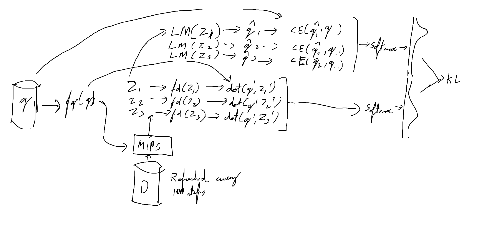

# [Questions Are All You Need to Train a Dense Passage Retriever](https://arxiv.org/abs/2206.10658)

**Source Code:** [Github](https://github.com/DevSinghSachan/art)

**Datasets:** WebQ, NQ-Open, Squad-Open, Trivia, EntityQuestions

**Time to read:**

**Author:** Sanchan et all

**Year of Submission:** 2022

## What problem does it solve?

Unsupervised reranker for retrieval based models.

## How does it solve it?

```python
q = query
D = database
lm_model = LargeModel()

q_embedding = embedding_q(q)
search_results = search(q, D)

dot_products = []
eval_scores = []
for z in search_results:
  # Reranker
  z_embedding = embedding_d(z)
  dot_product = dot(z_embedding, q_embedding)
  dot_products.append(dot_product)

  # Pretrained frozen Language model
  eval_score = lm_model.evaluate(q, z)
  eval_scores.append(eval_score)

dot_products = softmax(dot_products)
eval_scores = softmax(eval_scores)

loss = kl_divergence(dot_products, eval_scores)
```



## How is this paper novel?

* Unsupervised reranker

## Key takeaways

## What I still do not understand?

## Ideas to pursue

* Does not tackle the case where an answer comes from more than one document
