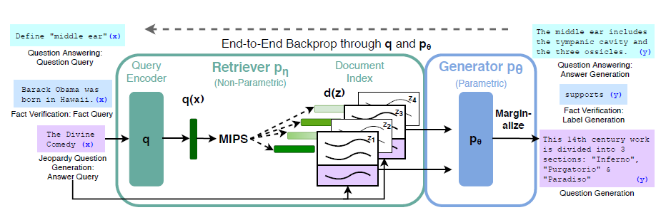

# [Retrieval-Augmented Generation for Knowledge-Intensive NLP Tasks](https://arxiv.org/abs/2005.11401)

<https://www.youtube.com/watch?v=JGpmQvlYRdU>

**Source Code:** [Github](https://github.com/huggingface/transformers/blob/master/examples/rag/)

**Datasets:** natural questions, trivia QA, web questions, curated trec, open ms marco, jeopardy, fever, [TempLAMA](https://github.com/google-research/language/tree/master/language/templama)

**Time to read:** ?

**Author:** Facebook AI

**Year of Submission:** 2020

## What problem does it solve?

Retreival augmented LLM

* Models hallucinate less.
* Knowledge base can be hotswapped
* Knowledge base can be inspected and edited

## How does it solve it?

* parametric memory is any sequence to sequence model
* non-parametric memory is a crude search engine using maximal inner product search (FAISS)

* RAG-token - one set of neighbours for each generated token
* RAG-sequence - one set of neighbours for each generated sequence

Every neighbour is a 100 word chunk from wikipedia a total of 21M chunks. 5-10 neighbours are used per prompt.

```py
# RAG sequence
prompt_embedding = BERT(prompt_tokens)
neighbour_tokens = search_engine(prompt_embedding)

masked_prompt = bert_mask(prompt_tokens)
masked_all_tokens = concat([neighbour_tokens, masked_prompt])
all_tokens = concat([neighbour_tokens, masked_prompt])
x = masked_all_tokens
y_ = all_tokens

# Beam decoding? 
y = BART(x)

# Marginalization?
loss = sum(cross_entropy(y, y_))
```

### Model



## How is this paper novel?

* Use of non-parametric memory in form of a MIPS search engine (dense passage retrieval)

## Key takeaways

* BM25 is worse for everything except FEVER (fact checking dataset)
* Finetuning the query embeddings helps a little (1-4% gain)
* If the retreived documents were not useful at the begining of training, then it never looks at documents later. Retreival collapse. Only happens when the query embeddings is not frozen.
* It can leverage information from multiple documents.
* Retrieval index can be hotswapped
* No difference in quality of generation for either 5 or 10 neighbours for training. At eval performance peaks at 10. (Maybe its an artificat of the datasets it was evaled on? The datasets are expecting the answer to be in wikipedia.)

## What I still do not understand?

* "Sum probabilities accross beams for marginals"

## Ideas to pursue

* Replace BART with GPT-like
* Use a cross attention with the neighbours
