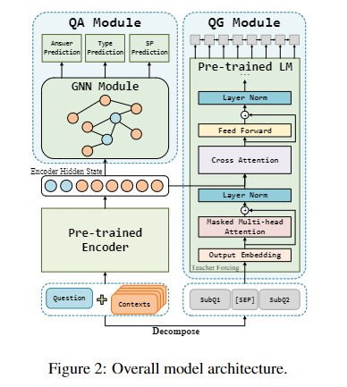

# [TODO] [Ask to Understand: Question Generation for Multi-hop Question Answering](https://arxiv.org/pdf/2203.09073.pdf)

## Meta

* Journal -
* Year - 2022
* Author - Beijing Institute of Technology, Beijing, China
* Code - 
* One liner - Use transformer encoder embeddings as both GNN input and cross encoder input for decoder. Decoder generates questions, GNN answers them.
* Model - GPT2, DFGN
* Datasets - 
* Baselines - DFGN, DecompRC

## Training flow

## Algorithm

## List of experiments
