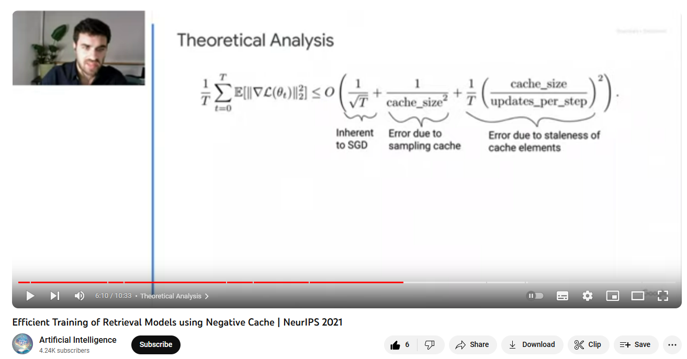

# [Efficient Training of Retrieval Models Using Negative Cache](https://proceedings.neurips.cc/paper/2021/hash/2175f8c5cd9604f6b1e576b252d4c86e-Abstract.html)

**Source Code:**

**Datasets:** MSMARCO/TREC, NQ

**Author:** Google

**Journal:** Neurips

**Year of Submission:** 2021

**Youtube:** [video](https://www.youtube.com/watch?v=FncbQ2HGoEA)

## What problem does it solve?

- Scalable updation of embeddings in database
- Continious learning for any scale information retrieval

## How does it solve it?

### Training flow

1. We have a query network and a document network
2. Take query embedding and positive document embedding
3. Retain the data and embeddings from previous iterations
4. Search cache with perturbed maximum inner product search. This is the negative document.
5. Get the feched document from cache and feed it into the document network so that we can backprop with current weights
6. Apply loss on query embedding, positive document embedding and negative document embedding.
7. Randomly sample a few documents, compute their embedding and push onto the cache, removing the oldest entries.

### Inference

Not explicitly mentioned

1. Embed query
2. Run MIPS on database
3. Return results
4. If any of the database embeddings were generated by an older model checkpoint, then update them.

### Equations



#### Assumptions

1. **Change in parameters follow L-Lipschitz:** Since the embeddings are normalized, the maximum deviation in embeddings regardless of parameters is 2 (diameter of unit sphere)
2. **Query and document embeddings are bounded:** Since the embeddings are normalized, their magnitude is 1.
3. **The score functions have bounded gradients:** `||grad(s[i][j])|| < some constant` `s[i][j]` is the similarity matrix generated by dot products of normalized embeddings. We can say that `s = xy`. So, partial derivates of `s` with respect to `x` and `y` is `y` and `x`. Since `x` and `y` are normalized vectors. Maximum magnitude of `grad(s[i][j])` will be 1.

#### Softmax Cross-Entropy Loss for Retrieval

`LCE_i(Θ) = -log(exp(φ s_iy_i) / Σ from j=1 to m exp(φ s_jy_j))`

- Maximize the similarity score of the correct (query, document) pair.
- Minimize the scores for all incorrect (query, document) pairs.
- s_iy_i similarity between query i and document y_i (dot product of embeddings)

#### Approximate gradient (Theorem 2)

```python
s_tilde = s + gumbel_noise(s.shape)
p = softmax(s_tilde)

positive_document_gradient = -beta * grad(s[i][y[i]], q)
negative_documents_gradient = sum([p[i][j] * beta * grad(s[i][j], q) for j in range(0,m)])
approx_ce_grad[i] = positive_document_gradient + negative_documents_gradient
```

- `approx_ce_grad` - approximate gradient because full gradient is intractable as we have to backprob through entire database
- For positive document, we want the weights to be down the gradient so we have the negative sign. For the negative documents, we want the weights to move up the gradient so it stays positive.
- `beta` - some constant
- `grad(a, b)` - gradient of a wrt b
- `s[i][j]` - similarity of query i with document j
- `q` - query embedding
- `y[i]` - Positive document id for query i
- `p[i][j]` - softmax of `s_tilde[i][j]`. It is there to scale the gradients wrt to the estimated probability the model predicted it with. Low probability documents should not be penalized as harshly.

```python
# Expectation of X
E[X] = sum([p[i] * x[i] for i in range(m)])
```

```python
sum([p[i][j] * beta * grad(s[i][j], q) for j in range(0,m)])
= E[grad(s[i][J])] # Let J be the document id which is most likely to be sampled due to gumbel trick
```

Therefore

``` python
approx_ce_grad[i]
```

### Model

BERT-base

## How is this paper novel?

## List of experiments

### Ablation Studies

### Efficiency analysis

## Preliminaries

### L-Lipschitz

A function ff is said to be Lipschitz continuous if there exists a real number L (non-negative), known as the Lipschitz constant, such that for every pair of points, the difference in the function values at those points is at most LL times the distance between the points.

More formally, a function `f:Rn→Rm` is said to be L-Lipschitz if there exists a constant L such that for all points x and y in its domain: `∣∣f(x)−f(y)∣∣ ≤ L∣∣x−y∣∣`

### Gumbel random noise

PDF of gumbel distributon
= f(x) = exp(-(x + exp(-x)))

CDF = F(x) = exp(−exp(−x))

One common method to sample from a distribution, if we can't do so directly, is to use the inverse of its CDF.
X=F^−1(U)

```txt
Let U = F(x)
U = exp(−exp(−x))
x = -ln(-ln(U))
```

noise `g_i = -ln(-ln(rand()))` where `rand()` generates numbers in range `[0,1]`

### Gumbel max trick

Given a probability distribution P with each element p_i.

Sampling from this probability distribution naively is not differentiable.

In Gumbel trick we do `log(new_p_i) = log(p_i) + gumbel random noise`

We argue that running `max` over this new distribution is equivalent to sampling

- If the difference between `p_i` and its peers is very large, then peturbation might not effect its ranking
- If the difference between `p_i` and its peers is small, then peturbation might effect its ranking
- Whatever is top ranked, is most likely to get chosen (sampled), so we just take the max
- This process is differentiable wrt to the probability of the sample

The same concept is used in temperature in LLM token sampling.

### Infinity norm

```python
max([abs(v) for v in V])
```

It is a special case of p norm

```python
sum([abs(v) ** p for v in V]) ** (1/p)
```

When p -> inf, the maximum value dominates and becomes the answer

## GPU hours

## Key takeaways

## What I still do not understand?

- what is O(1) smooth?
- what is first order convergence?
- what is ANCE?

## Ideas to pursue

## Similar papers
