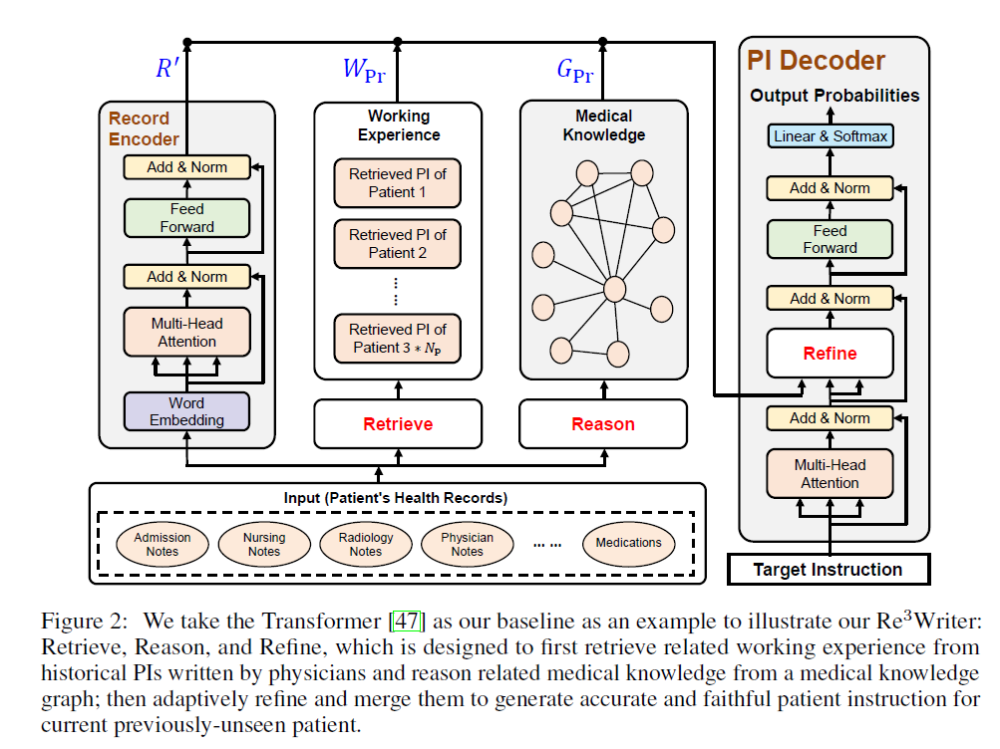

# [Retrieve, Reason, and Refine: Generating Accurate and Faithful Patient Instructions](https://proceedings.neurips.cc/paper_files/paper/2022/hash/77c08a6e68ae25433f1d117283c0e312-Abstract-Conference.html)

**Source Code:** https://github.com/AI-in-Health/Patient-Instructions

**Datasets:** Patient Instruction (PI), [MIMIC-III](https://physionet.org/content/mimiciii/1.4/)

**Author:** Oxford, Yale, Peking, Tencent

**Journal:** Neurips

**Year of Submission:** 2022

## What problem does it solve?

## How does it solve it?

### Training flow

1. Use a transformer encoder to embed patient records (medical history)
2. Use a retriever to find medical instructions (prescriptions etc) from a database.
3. A graph NN, takes clical codes as nodes and edges are co-occurance frequencies it outputs embeddings
4. Take the three embeddings and feed each into a cross attention head taking previous hidden state of decoder as the other input to MHA
5. Linearly interpolate the MHA output and feed that onward to the next layer of decoder
6. Compute CE loss with decoder output with labled data

### Inference

same as training without loss

### Equations

### Model

## How is this paper novel?

## List of experiments

BLEU, METEOR, ROUGE, Human

Ablations - Effect of each of the 3 components

## Preliminaries

## GPU hours

## Key takeaways

## What I still do not understand?

## Ideas to pursue

## Similar papers
