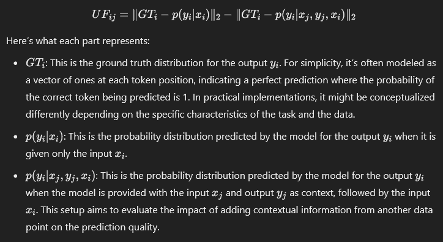

# [DELIFT: Data Efficient Language model Instruction Fine Tuning](https://arxiv.org/abs/2411.04425)

## Meta

* Journal   - Arxiv
* Year      - 2024
* Author    - University of Illinois, IBM research
* Code      - https://github.com/agarwalishika/delift
* Slides    - 
* One liner - Use pairwise perplexity advantage of using one shot over zero shot for each pair in training set to get a score matrix. Use submodular subset selection to shortlist. 
* Model     - Qwen2, Phi-3, Prometheus (for eval)
* Datasets  - MixInstruct,  P3 (Public Pool of Prompts), HotpotQA, MMLU, MT-Bench, SQuAD
* Baselines - [SelectIT](./SELECTIT.md), [Less](./LESS.md)

## Flow

- Populate a score matrix based on using sample i as 1-shot to predict sample j. Score is the perplexity advantage of using 1-shot over 0-shot.
- Send this score matrix to submodular subset selection to shortlist
- Finetune downstream model on this shortlist

## Equations

### Utility Function

> Decrease in perplexity when a specific 1-shot is added

## Proofs

## Algorithms

## Experiments

* ICL vs QLORA
* subset size vs judge model score
* technique vs judge model score (histogram)

## Rebuttals
