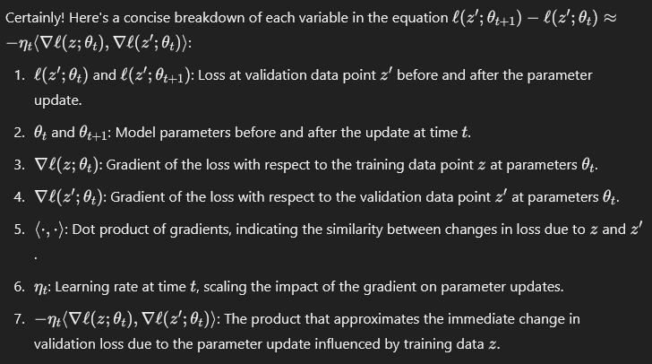
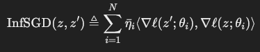
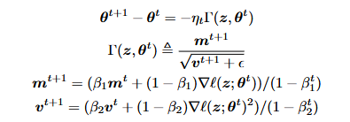
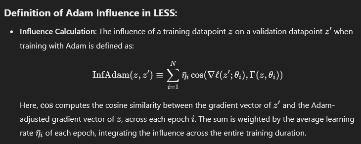

# [LESS: Selecting Influential Data for Targeted Instruction Tuning](https://openreview.net/forum?id=dViuaBxVul)

## Meta

* Journal   - ICML
* Year      - 2024
* Author    - Princeton, University of Washington
* Code      - https://github.com/princeton-nlp/LESS
* Slides    - 
* One liner - LORA warmup-finetune the model. Random project LORA gradients. Cosine similarity train and val gradients. Pick top K.
* Model     - LLAMA-2-7B, LLAMA-2-13B, MISTRAL-7B
* Datasets  - MMLU, TYDIQA, BBH
* Baselines - Full, Random, BM25, [DSIR](./DSIR.md), [RDS](./RDS.md) 

## Flow

- **LoRA Warm-Up**: Use LoRA (Low-rank Adaptation) to finetune the model with a reduced number of trainable parameters. This step serves to warm up the model, particularly adapting the Adam optimizer parameters for efficient subsequent training.
  
- **Gradient Adaptation for Adam**: Modify the gradient computation to accommodate the Adam optimizer’s requirements. This involves using gradients that consider both the first (momentum) and second (velocity) moments as adapted by Adam, rather than simple direct gradients.
  
- **Epoch-Wise Gradient Computation**: For each model checkpoint after an epoch, compute the gradients for each datapoint in both the training and validation sets. These gradients are computed considering the adaptations made for the Adam optimizer.
  
- **Random Projection of Gradients**: Apply a random projection to the computed gradients to reduce their dimensionality. This projection uses an Nxd matrix where each entry is randomly assigned a value of -1 or 1, effectively reducing the size of the gradient vectors while trying to preserve their relative distances and inner products.
  
- **Compute Average Cosine Similarity**: For each datapoint in the training set, calculate the average cosine similarity between its projected gradient and the projected gradients of the entire validation set. This average represents the influence score of the training datapoint, indicating how closely its gradient aligns with those of the validation datapoints.
  
- **Select Top-Scoring Elements**: From the training set, select the top \(K\) elements with the highest scoring based on their computed influence scores. These selected datapoints are hypothesized to be the most beneficial for training the model to perform well on the validation set.

## Equations

### Per step influence

> The more aligned the training and validation gradients are, the faster the validation loss will decrease.

### Trajectory influence

> Throughout the course of training how much a training samples gradient and a validation samples gradient align.

### Off the shelf Adam

- theta - parameters
- t - time step
- m - exponential moving average of gradients (bias corrected)
- v - exponential moving average of gradients squared (bias corrected)
- gamma - adam gradients
- eta - learning rate

### Adam Adjusted

> Same as trajectory influence but replace simple gradients with adam gradients because we will be using adam to train the model anyways

### Johnson-Lindenstrauss Lemma 

Use a Nxd matrix filled with -1 and 1 to down project a 1xN vector (gradient vector) to a dx1 vector

> This resembles a random walk? d random walks over the gradient vector?

## Proofs

## Algorithms

## Experiments

* Full training vs data percentage on different models
* Adam gradient vs basic gradient
* Number of warmup percentage of data
* Scores from checkpoints from multiple warmup runs summed over (N vs accuracy)
