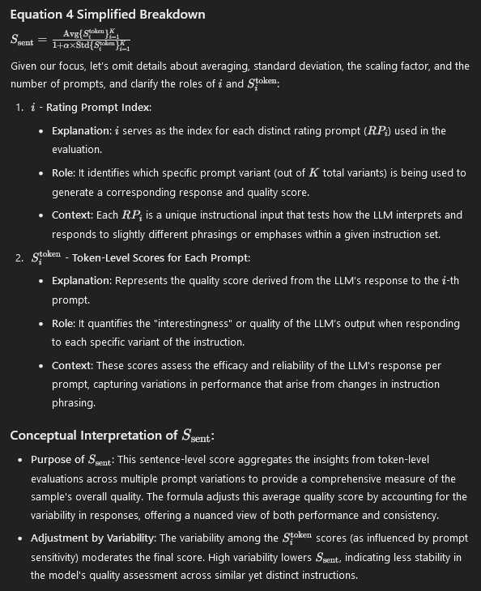

# [SelectIT: Selective Instruction Tuning for LLMs via Uncertainty-Aware Self-Reflection](https://openreview.net/forum?id=QNieOPt4fg)

## Meta

* Journal   - Neurips
* Year      - 2024
* Author    - Harbin Institute of Technology, University of Macau
* Code      - https://github.com/Blue-Raincoat/SelectIT
* Slides    - https://neurips.cc/media/neurips-2024/Slides/95238.pdf
* One liner - Ask the model to generate a score for the output it just generated. Then do mixture of rating prompts and mixture of models.
* Model     - LLaMA-2, Mistral-7B, LLaMA-3-8B 
* Datasets  - MMLU, BBH, GSM, TydiQA, CodeX, AE, WizardLM, Orca-GPT4, WMT17
* Baselines - [Alpaca-GPT4](./Alpaca-GPT4.md), [LIMA](./LIMA.md), [AlpaGasus](./AlpaGaus.md), [Q2Q](./Q2Q.md), [Instruction Mining](./InstructionMining.md)

## Flow

1. For each generation use a rating prompt to self-evaluate how good the generation was and ask it to output a score 1-5.
2. For each token in generation measure how much the confidence deviates from average confidence. These are the "interesting" tokens.
3. Use Equation 2 and 3 to average over this interestingness for the entire generation sequence.
4. Use K different rating prompts to repeat steps 1-3 and use Equation 4 to average that.
5. Use N different models to repeat step 4 and use equation 5 to average that.

## Equations

### Token Level (Equation 2 and 3)

S^Token = How non-boring (potentially important) the token is. Is the model suddenly super confident/diffident about a specific token?

S^Token takes a sequence of logits (generation) as input and returns a scalar for that generation.

### Sentence Level (Equation 4)

S^sent = Agreement between the rating prompts for "interestingness" for a generation.

S^sent takes K generates made with K rating prompts and takes their average and penalizes the standard deviation.

### Model Level (Equation 5)

## Proofs

## Algorithms

## Experiments

* Main Table
* Effect of IT Data Quantity
* Effect of Multiple Rating Prompts
* Effect of Uncertainty
* Effect of Different Reflection Strategy (Token/Sentence/Model)
* Effect of Data Imbalance - Some baselines used imbalanced data
* Machine translation on WMT17
* Speed/Time/Cost analysis
* Other selection strategies like random
* Data Representation Analysis - TSNE of last layer embeddings for random selected vs SELECTIT selected
* Average length of samples
* High-Quality Data in SelectIT
* Examples where SelectIT selected and alpha gaus discarded and vice versa

## Rebuttals

### Reviewer 1

* **Reliance on Tuning K:** The method depends on tuning the parameter ( K ), which can significantly affect model performance. This dependency introduces additional complexity and may require extensive experimentation to optimize.
* **Use of Multiple Base Models:** Although the paper claims not to use external resources, it actually relies on multiple different base models to obtain the model-level score. This reliance contradicts the claim of being purely self-reflective and can be confusing, as the title suggests the method is entirely self-contained.
* **Sentence-Level Quality Evaluation:** The sentence-level quality evaluation requires multiple rating prompts. It is unclear whether other methods, such as AlpaGasus, would achieve similar performance if they also used multiple rating prompts. This comparison is missing and could be critical for understanding the true advantage of the proposed method.
* **Single Dataset Evaluation:** All evaluations are conducted on a single training dataset, making it questionable whether this method can be generalized to other datasets, such as WizardLM, or multi-turn data, like the ShareGPT dataset. Testing on a more diverse set of datasets would strengthen the paper's claims of robustness and general applicability.

### Reviewer 2

* **Use of Multiple Base Models:** The paper states initially that it does not use extra resources for its new method. However, it mentions later that they used different sizes of LLaMA 2 models to help choose the best instruction data. This contradicts their first claim about not needing extra resources.
* the paper lacks a separate section on limitation of the approach?

### Reviewer 3

* **Foreign key to Table 1** - From the table 3, it seems sentence-R works the best so what if we trained model on the data just from the sentence-R? BTW, what is the ID 6, 7, 8 means in that Table?
* **Ablation for number of models used** - My main question is that do we really need all three types selection models, can one or two of them already achieve great performance?
* **Time performance analysis** - What is the overhead of this data selection model? Like how long does it take to finish the process on 10K dataset.
